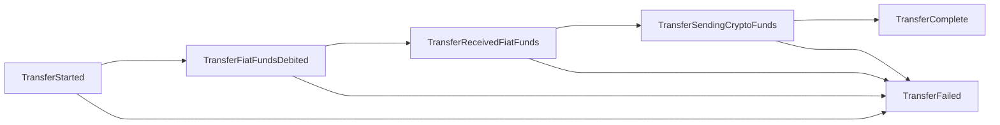
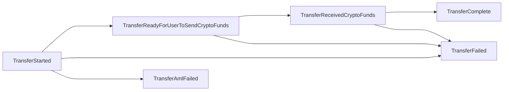

# FiatConnect CICO Provider API Specification "RFC"

# 0. Table of Contents

- [0. Table of Contents](#0-table-of-contents)
- [1. Introduction](#1-introduction)
  * [1.1. A Note on Celo & Multi-Chain Support](#11-a-note-on-celo---multi-chain-support)
  * [1.2. Notational Conventions](#12-notational-conventions)
- [2. Lifecycle of a Transfer](#2-lifecycle-of-a-transfer)
  * [2.1. Quote](#21-quote)
  * [2.2. KYC](#22-kyc)
    + [2.2.1. KYC Status Monitoring](#221-kyc-status-monitoring)
  * [2.3. Fiat Accounts](#23-fiat-accounts)
  * [2.4. Creating the Transfer](#24-creating-the-transfer)
    + [2.4.1. Transfer Status Monitoring](#241-transfer-status-monitoring)
- [3. API Specification](#3-api-specification)
  * [3.1. Geolocation](#31-geolocation)
  * [3.2. Authentication & Authorization](#32-authentication---authorization)
    + [3.2.1. Sign-In With Ethereum](#321-sign-in-with-ethereum)
	  - [3.2.1.1. SIWE Sessions](#3211-siwe-sessions)
      - [3.2.1.2. SIWE Resources](#3212-siwe-resources)
	  - [3.2.1.3. SIWE Message Format](#3213-siwe-message-format)
	  - [3.2.1.4. Session Cookies](#3214-session-cookies)
	  - [3.2.1.5. `POST /auth/login`](#3215--post--auth-login-)
	    * [3.2.1.5.1. Parameters](#32151-parameters)
		  + [3.2.1.5.1.1. Request Body](#321511-request-body)
	    * [3.2.1.5.2. Responses](#32152-responses)
		  + [3.2.1.5.2.1. HTTP `200`](#321521-http--200-)
		  + [3.2.1.5.2.2. HTTP `401`](#321522-http--401-)
	    * [3.2.1.5.3. Semantics](#32153-semantics)
		  + [3.2.1.5.3.1. Success](#321531-success)
		  + [3.2.1.5.3.2. Failure](#321531-failure)
		    - [3.2.1.5.3.2.1. `InvalidSignature`](#3215321--invalidsignature-)
		    - [3.2.1.5.3.2.2. `InvalidParameters`](#3215322--invalidparameters-)
		    - [3.2.1.5.3.2.3. `ContractLoginNotSupported`](#3215323--contractloginnotsupported-)
		    - [3.2.1.5.3.2.4. `NonceInUse`](#3215324--nonceinuse-)
		    - [3.2.1.5.3.2.5. `IssuedTooEarly`](#3215325--issuedtooearly-)
		    - [3.2.1.5.3.2.6. `ExpirationTooLong`](#3215326--expirationtoolong-)
	  - [3.2.1.6. Using Sessions](#3216-using-sessions)
	    * [3.2.1.6.1. Non-Privileged Endpoints](#32161-non-privileged-endpoints)
	    * [3.2.1.6.2. Privileged Endpoints](#32162-privileged-endpoints)
    + [3.2.2.Client API Key](#322-client-api-key)
  * [3.3. Formal Specification](#33-formal-specification)
    + [3.3.1. Quote Endpoints](#331-quote-endpoints)
      - [3.3.1.1. `GET /quote/in`](#3311--get--quote-in-)
        * [3.3.1.1.1. Parameters](#33111-parameters)
          + [3.3.1.1.1.1. Query Parameters](#331111-query-parameters)
        * [3.3.1.1.2. Responses](#33112-responses)
          + [3.3.1.1.2.1. HTTP `200`](#331121-http--200-)
        * [3.3.1.1.2.2. HTTP `400`](#331122-http--400-)
        * [3.3.1.1.3. Semantics](#33113-semantics)
          + [3.3.1.1.3.1. Success](#331131-success)
          + [3.3.1.1.3.2. Failure](#331132-failure)
            - [3.3.1.1.3.2.1. `GeoNotSupported`](#3311321--geonotsupported-)
            - [3.3.1.1.3.2.2. `CryptoAmountTooLow`](#3311322--cryptoamounttoolow-)
            - [3.3.1.1.3.2.3. `CryptoAmountTooHigh`](#3311323--cryptoamounttoohigh-)
            - [3.3.1.1.3.2.4. `FiatAmountTooLow`](#3311324--fiatamounttoolow-)
            - [3.3.1.1.3.2.5. `FiatAmountTooHigh`](#3311325--fiatamounttoohigh-)
            - [3.3.1.1.3.2.6. `CryptoNotSupported`](#3311326--cryptonotsupported-)
            - [3.3.1.1.3.2.7. `FiatNotSupported`](#3311327--fiatnotsupported-)
            - [3.3.1.1.3.2.8. `InvalidParameters`](#3311328--invalidparameters-)
      - [3.3.1.2. `GET /quote/out`](#3312--get--quote-out-)
        * [3.3.1.2.1. Parameters](#33121-parameters)
          + [3.3.1.2.1.1. Query Parameters](#331211-query-parameters)
        * [3.3.1.2.2. Responses](#33122-responses)
          + [3.3.1.2.2.1. HTTP `200`](#331221-http--200-)
          + [3.3.1.2.2.2. HTTP `400`](#331222-http--400-)
        * [3.3.1.2.3. Semantics](#33123-semantics)
          + [3.3.1.2.3.1. Success](#331231-success)
          + [3.3.1.2.3.2. Failure](#331232-failure)
            - [3.3.1.2.3.2.1. `GeoNotSupported`](#3312321--geonotsupported-)
            - [3.3.1.2.3.2.2. `CryptoAmountTooLow`](#3312322--cryptoamounttoolow-)
            - [3.3.1.2.3.2.3. `CryptoAmountTooHigh`](#3312323--cryptoamounttoohigh-)
            - [3.3.1.2.3.2.4. `FiatAmountTooLow`](#3312324--fiatamounttoolow-)
            - [3.3.1.2.3.2.5. `FiatAmountTooHigh`](#3312325--fiatamounttoohigh-)
            - [3.3.1.2.3.2.6. `CryptoNotSupported`](#3312326--cryptonotsupported-)
            - [3.3.1.2.3.2.7. `FiatNotSupported`](#3312327--fiatnotsupported-)
            - [3.3.1.2.3.2.8. `InvalidParameters`](#3311328--invalidparameters-)
    + [3.3.2. KYC Endpoints](#332-kyc-endpoints)
      - [3.3.2.1. `POST /kyc/:kycSchema`](#3321--post--kyc--kycschema-)
        * [3.3.2.1.1. Parameters](#33211-parameters)
          + [3.3.2.1.1.1. Path Parameters](#332111-path-parameters)
          + [3.3.2.1.1.2. Request Body](#332112-request-body)
        * [3.3.2.1.2. Responses](#33212-responses)
          + [3.3.2.1.2.1. HTTP `200`](#332121-http--200-)
          + [3.3.2.1.2.2. HTTP `400`](#332122-http--400-)
          + [3.3.2.1.2.3. HTTP `409`](#332123-http--409-)
        * [3.3.2.1.3. Semantics](#33213-semantics)
          + [3.3.2.1.3.1. Success](#332131-success)
          + [3.3.2.1.3.2. Failure](#332132-failure)
            - [3.3.2.1.3.2.1. `UnsupportedSchema`](#3321321--unsupportedschema-)
            - [3.3.2.1.3.2.2. `InvalidSchema`](#3321322--invalidschema-)
            - [3.3.2.1.3.2.3. `ResourceExists`](#3321323--resourceexists-)
      - [3.3.2.2. `GET /kyc/:kycSchema/status`](#3322--get--kyc--kycschema-status-)
        * [3.3.2.2.1. Parameters](#33221-parameters)
          + [3.3.2.2.1.1. Path Parameters](#332211-path-parameters)
        * [3.3.2.2.2. Responses](#33222-responses)
          + [3.3.2.2.2.1. HTTP `200`](#332221-http--200-)
          + [3.3.2.2.2.2. HTTP `404`](#332222-http--404-)
        * [3.3.2.2.3. Semantics](#33223-semantics)
          + [3.3.2.2.3.1. Success](#332231-success)
          + [3.3.2.2.3.2. Failure](#332232-failure)
            - [3.3.2.2.3.2.1. `ResourceNotFound`](#3322321--resourcenotfound-)
      - [3.3.2.3. `DELETE /kyc/:kycSchema`](#3323--delete--kyc--kycschema-)
        * [3.3.2.3.1. Parameters](#33231-parameters)
          + [3.3.2.3.1.1. Path Parameters](#332311-path-parameters)
        * [3.3.2.3.2. Responses](#33232-responses)
          + [3.3.2.3.2.1. HTTP `200`](#332321-http--200-)
          + [3.3.2.3.2.2. HTTP `404`](#332322-http--404-)
        * [3.3.2.3.3. Semantics](#33233-semantics)
          + [3.3.2.3.3.1. Success](#332331-success)
          + [3.3.2.3.3.2. Failure](#332332-failure)
            - [3.3.2.3.3.2.1. `ResourceNotFound`](#3323321--resourcenotfound-)
    + [3.3.3. Fiat Account Endpoints](#333-fiat-account-endpoints)
      - [3.3.3.1. `POST /accounts/:fiatAccountSchema`](#3331--post--accounts--fiataccountschema-)
        * [3.3.3.1.1. Parameters](#33311-parameters)
          + [3.3.3.1.1.1. Path Parameters](#333111-path-parameters)
          + [3.3.3.1.1.2. Request Body](#333112-request-body)
        * [3.3.3.1.2. Responses](#33312-responses)
          + [3.3.3.1.2.1. HTTP `200`](#333121-http--200-)
          + [3.3.3.1.2.2. HTTP `400`](#333122-http--400-)
          + [3.3.3.1.2.3. HTTP `409`](#333123-http--409-)
        * [3.3.3.1.3. Semantics](#33313-semantics)
          + [3.3.3.1.3.1. Success](#333131-success)
          + [3.3.3.1.3.1. Failure](#333131-failure)
            - [3.3.3.1.3.1.1. `UnsupportedSchema`](#3331311--unsupportedschema-)
            - [3.3.3.1.3.1.2. `InvalidSchema`](#3331312--invalidschema-)
            - [3.3.3.1.3.1.3. `ResourceExists`](#3331313--resourceexists-)
      - [3.3.3.2. `GET /accounts`](#3332--get--accounts-)
        * [3.3.3.2.1. Parameters](#33321-parameters)
        * [3.3.3.2.2. Responses](#33322-responses)
          + [3.3.3.2.2.1. HTTP `200`](#333221-http--200-)
        * [3.3.3.2.3. Semantics](#33323-semantics)
          + [3.3.3.2.3.1. Success](#333231-success)
      - [3.3.3.3. `DELETE /accounts/:fiatAccountId`](#3333--delete--account--fiataccountid-)
        * [3.3.3.3.1. Parameters](#33331-parameters)
          + [3.3.3.3.1.1. Path Parameters](#333311-path-parameters)
        * [3.3.3.3.2. Responses](#33332-responses)
          + [3.3.3.3.2.1. HTTP `200`](#333321-http--200-)
          + [3.3.3.3.2.2 HTTP. `404`](#333322-http--404-)
        * [3.3.3.3.3. Semantics](#33333-semantics)
          + [3.3.3.3.3.1. Success](#333331-success)
          + [3.3.3.3.3.1. Failure](#333331-failure)
            - [3.3.3.3.3.1.1. `ResourceNotFound`](#3333311--resourcenotfound-)
    + [3.3.4. Transfer Endpoints](#334-transfer-endpoints)
      - [3.3.4.1. `POST /transfer/in`](#3341--post--transfer-in-)
        * [3.3.4.1.1. Parameters](#33411-parameters)
          + [3.3.4.1.1.1. Headers](#334111-headers)
          + [3.3.4.1.1.2. Request Body](#334112-request-body)
        * [3.3.4.1.2. Responses](#33412-responses)
          + [3.3.4.1.2.1. HTTP `200`](#334121-http--200-)
          + [3.3.4.1.2.2. HTTP `400`](#334122-http--400-)
          + [3.3.4.1.2.3. HTTP `404`](#334123-http--404-)
          + [3.3.4.1.2.4. Idempotency Key Errors](#334124-idempotency-key-errors)
        * [3.3.4.1.3. Semantics](#33413-semantics)
          + [3.3.4.1.3.1. Success](#334131-success)
          + [3.3.4.1.3.2. Failure](#334132-failure)
            - [3.3.4.1.3.2.1. `KycExpired`](#3341321--kycexpired-)
            - [3.3.4.1.3.2.2. `TransferNotAllowed`](#3341322--transfernotallowed-)
            - [3.3.4.1.3.2.3. `InvalidQuote`](#3341323--invalidquote-)
            - [3.3.4.1.3.2.4. `ResourceNotFound`](#3341324--resourcenotfound-)
            - [3.3.4.1.3.2.5. `InvalidFiatAccount`](#3341325--invalidfiataccount-)
      - [3.3.4.2. `POST /transfer/out`](#3342--post--transfer-out-)
        * [3.3.4.2.1. Parameters](#33421-parameters)
          + [3.3.4.2.1.1. Headers](#334211-headers)
          + [3.3.4.2.1.2. Request Body](#334212-request-body)
        * [3.3.4.2.2. Responses](#33422-responses)
          + [3.3.4.2.2.1. HTTP `200`](#334221-http--200-)
          + [3.3.4.2.2.2. HTTP `400`](#334222-http--400-)
          + [3.3.4.2.2.3. HTTP `404`](#334223-http--404-)
          + [3.3.4.2.2.4. Idempotency Key Errors](#334224-idempotency-key-errors)
        * [3.3.4.2.3. Semantics](#33423-semantics)
          + [3.3.4.2.3.1. Success](#334231-success)
          + [3.3.4.2.3.2. Failure](#334232-failure)
            - [3.3.4.2.3.2.1. `KycExpired`](#3342321--kycexpired-)
            - [3.3.4.2.3.2.2. `TransferNotAllowed`](#3342322--transfernotallowed-)
            - [3.3.4.2.3.2.3. `InvalidQuote`](#3342323--invalidquote-)
            - [3.3.4.2.3.2.4. `ResourceNotFound`](#3342324--resourcenotfound-)
            - [3.3.4.2.3.2.5. `InvalidFiatAccount`](#3342325--invalidfiataccount-)
      - [3.3.4.3. `GET /transfer/:transferId/status`](#3343--get--transfer--transferid-status-)
        * [3.3.4.3.1. Parameters](#33431-parameters)
          + [3.3.4.3.1.1. Path Parameters](#334311-path-parameters)
        * [3.3.4.3.2. Responses](#33432-responses)
          + [3.3.4.3.2.1. HTTP `200`](#334321-http--200-)
          + [3.3.4.3.2.2. HTTP `404`](#334322-http--404-)
        * [3.3.4.3.3. Semantics](#33433-semantics)
          + [3.3.4.3.3.1. Success](#334331-success)
          + [3.3.4.3.3.2. Failure](#334332-failure)
            - [3.3.4.3.3.2.1. `ResourceNotFound`](#3343321--resourcenotfound-)
- [4. Transfer State Machines](#4-transfer-state-machines)
  * [4.1. Transfers In](#41-transfers-in)
  * [4.2. Transfers Out](#42-transfers-out)
- [5. Webhooks](#5-webhooks)
  * [5.1. Webhook Requests](#51-webhook-requests)
    + [5.1.1. `WebhookKycStatusEventSchema`](#511--webhookkycstatuseventschema-)
    + [5.1.2. `WebhookTransferInStatusEventSchema`](#512--webhooktransferinstatuseventschema-)
    + [5.1.3. `WebhookTransferOutStatusEventSchema`](#513--webhooktransferoutstatuseventschema-)
- [6. AML Considerations](#6-aml-considerations)
- [7. Sandbox Environment](#7-sandbox-environment)
  * [7.1. Celo Network](#71-celo-network)
  * [7.2. Authentication](#72-authentication)
  * [7.3. KYC](#73-kyc)
  * [7.4. Fiat Accounts](#74-fiat-accounts)
  * [7.5. Transfers](#75-transfers)
- [8. Definitions](#8-definitions)
  * [8.1. Static Definitions](#81-static-definitions)
    + [8.1.1. `KycStatusEnum`](#811--kycstatusenum-)
    + [8.1.2. `ErrorEnum`](#812--errorenum-)
    + [8.1.3. `TransferTypeEnum`](#813--transfertypeenum-)
    + [8.1.3. `WebhookEventTypeEnum`](#813--webhookeventtypeenum-)
    + [8.1.4. `TransferStatusEnum`](#814--transferstatusenum-)
  * [8.2. Dynamic Definitions](#82-dynamic-definitions)
    + [8.2.1. `FiatTypeEnum`](#821--fiattypeenum-)
    + [8.2.2. `CryptoTypeEnum`](#822--cryptotypeenum-)
    + [8.2.3. `KycSchemaEnum`](#823--kycschemaenum-)
    + [8.2.4. `FiatAccountTypeEnum`](#824--fiataccounttypeenum-)
    + [8.2.5. `FeeTypeEnum`](#825--feetypeenum-)
    + [8.2.6. `FeeFrequencyEnum`](#826--feetypeenum-)
    + [8.2.7. `FiatAccountSchemaEnum`](#827--fiataccountschemaenum-)
  * [8.3. Initial Entity Support](#83-initial-entity-support)
    + [8.3.1. KYC Schemas](#831-kyc-schemas)
	  - [8.3.1.1. `PersonalDataAndDocuments`](#8311--personaldataanddocuments-)
	+ [8.3.2. Fiat Account Schemas](#832-fiat-account-schemas)
	  - [8.3.2.1. `AccountNumber`](#8311--accountnumber-)
      - [8.3.2.2. `MobileMoney`](#8322-mobilemoney)
        * [8.3.2.2.1. `SupportedOperatorEnum`](#83221-supportedoperatorenum)
      - [8.3.2.3. `DuniaWallet`](#8323-duniawallet)
      - [8.3.2.4. `IBANNumber`](#8324-ibannumber)
- [9. References](#9-references)
  * [9.1. Normative References](#91-normative-references)
    + [9.1.1. [RFC2119]](#911--rfc2119-)
    + [9.1.2. [RFC8174]](#912--rfc8174-)
    + [9.1.3. [RFC7519]](#913--rfc7519-)
    + [9.1.4. [EIP-4361]](#914--eip-4361-)
    + [9.1.5. [EIP-55]](#915--eip-55-)
    + [9.1.6. [EIP-191]](#916--eip-191-)
    + [9.1.7. [EIP-1271]](#917--eip-1271-)
    + [9.1.8. [EIP-2098]](#918--eip-2098-)
  * [9.2. Informative References](#92-informative-references)
    + [9.2.1. Webhook Best Practices](#921-webhook-best-practices)
    + [9.2.2. Idempotency Keys](#922-idempotency-keys)
    + [9.2.3. ISO 3166-1](#923-iso-3166-1)
    + [9.2.4. ISO 3166-2](#924-iso-3166-2)
    + [9.2.5. ISO 8601](#925-iso-8601)

# 1. Introduction

Liquidity between fiat and cryptocurrency assets is a common point of friction for new and growing crypto networks. In particular, cashing in/out
to/from crypto assets can be a difficult experience. Oftentimes, there is poor support for geographical regions, and fees and spreads may be excessively high.
Additionally, liquidity providers (referred to here as *cash-in/cash-out providers*, or *CICO providers*) share no common interface for allowing clients
to transfer funds between crypto and fiat. In many cases, CICO providers only provide transfers through their own native (typically web-based) interface.
In the few cases where CICO providers do offer an API for clients to integrate against, there is no uniformity in interface design across providers. Because each
provider's API is unique, native CICO integrations within clients require completely bespoke integrations. Furthermore, since individual CICO providers may only
offer limited geographical support for transfers, a client may have to integrate with many different providers in order to offer acceptably broad coverage to its
users, which requires considerable implementation effort. In many cases, this level of implementation effort is not feasible, which can lead to clients which
offer poor regional CICO availablity. This may lead to users seeking out a variety of different clients in order to access broad regional support. Not only is
this a poor user experience, but it is a detriment to both client developers and the network which those clients and CICO providers service. Clients unable to
devote *considerable* engineering effort towards CICO provider integration lose out, and network TVL is hamstrung due to poor user experience.

*FiatConnect* is a proposed solution to these issues. FiatConnect provides a standardized server-side API specification for CICO providers to provide
cash-in/cash-out functionality to clients. In addition to providing a standardized API specification, the FiatConnect ecosystem also offers a set of
client-side tooling through the *FiatConnect SDK* which makes it seamless for client developers to integrate against any CICO provider who operates
a *FiatConnect API*. By integrating with the FiatConnect SDK, clients will be able to implement a *single* native flow that can be re-used to perform
transfers with *any* provider operating a FiatConnect API; supporting new providers in the client merely requires a small amount of static configuration.
We believe that the FiatConnect specification will provide benefits to a multitude of parties:

1. **Client Developers**: Client developers will not have to exert any specific implementation effort in order to integrate with any particular CICO
   provider. After implementing a single native flow with the FiatConnect SDK, supporting new providers comes for free.
2. **CICO Providers**: CICO providers, particularly smaller ones, face a challenge in gaining initial adoption; they often must rely on the *client* to
   spend engineering effort creating an integration. With FiatConnect, this dependency is removed. Once a provider implements a FiatConnect API,
   they can immediately start providing crypto/fiat liquidity to *any*
   client, at no cost to the client developer. Client developers are thus much more likely to integrate with FiatConnect-compliant providers, making
   FiatConnect a compelling option for providers in order to drive adoption.
3. **End User**: Since FiatConnect will reduce the total amount of engineering work required to integrate providers in clients, end users will
   have access to a much broader selection of providers than they previously did. Furthermore, with the time saved by wallet/dapp developers by integrating
   with FiatConnect-compatible providers, they will have more bandwidth to innovate on their core products, further increasing value for the end user.

This document offers a specification for the FiatConnect API for CICO providers; it discusses the client-side FiatConnect SDK only when
necessary, and only as it concerns the FiatConnect API design.

## 1.1. A Note on Celo & Multi-Chain Support

This proposal has been designed without multi-chain support in mind; we assume all blockchain-related concepts (e.g., tokens, addresses) exist within
a single predetermined chain, agreed upon by all parties. It does not matter so much *what* this chain is, just that
all parties (clients and servers) are in agreement. If a provider wants to support multiple chains, they would have to stand up multiple APIs, with identical
interfaces. Likewise, clients would have to maintain per-chain instances of the FiatConnect SDK (discussed later) in order to support transfers from multiple chains.

This specification is explicitly designed for the Celo network. As such, the document will occasionally reference Celo-specific entities; in particular,
specific cryptocurrencies that are native to the Celo network.

The value of this specification extends well beyond the Celo network however; it is likely extensible by providing various parts of the specification with
an e.g. `chainId` parameter. In the interest of keeping this document as simple as possible, and to avoid introducing premature complexity, we assume
that clients and servers referenced in this document are operating against the Celo network.

## 1.2. Notational Conventions

The key words "MUST", "MUST NOT", "REQUIRED", "SHALL", "SHALL NOT", "SHOULD", "SHOULD NOT", "RECOMMENDED", "NOT RECOMMENDED", "MAY", and "OPTIONAL"
in this document are to be interpreted as described in BCP 14 [RFC2119] [RFC8174] when, and only when, they appear in all capitals, as shown here.

# 2. Lifecycle of a Transfer

We first provide a generalized and somewhat informal model of a "transfer" operation, which will inform the FiatConnect API specification later in this document.
The model should be general enough to support a wide range of CICO provider's requirements. This transfer lifecycle is based on the author's
own experience as a client developer for Valora on the Celo network; it should certainly be reviewed by CICO providers and amended if there are any shortcomings.

For a single provider, we model the lifecycle of a transfer (either *in* or *out*) as a number of discrete steps:

- 1. **Quote**: The client requests a quote for a transfer with the user's desired parameters.
- 2. **KYC**: For regulatory and compliance reasons, the user must provide data used for KYC verification purposes to the provider.
  - 2.1. **Monitor KYC**: KYC verification is assumed to be asynchronous; the client should be able to monitor its status.
- 3. **Fiat Account**: The user must be able to provide a source of fiat funds for transfers in, or a destination for transfers out.
- 4. **Create Transfer**: Once a user has provided KYC information and has an appropriate fiat account on file, the client initiates a transfer.
  - 4.1. **Monitor Transfer**: Transfers are assumed to be asynchronous; the client should be able to monitor its status.

## 2.1. Quote

Before a transfer is ever initiated, the client should be able to request a quote for a potential transfer based off of the user's
desired transfer parameters. We expect that quote generation will depend on the following parameters:

1. `fiatType`: The type of fiat currency used for the transfer.
2. `cryptoType`: The type of cryptocurrency used for the transfer.
3. `fiatAmount`/`cryptoAmount`: The amount of either fiat or cryptocurrency selected for the quote.
4. `region`: The user's geographical region.

We will explore the precise syntax and semantics of each of these parameters later. If a provider is unable to service a transfer
given specific quote parameters for whatever reason, the provider should return an error code that details why the quote failed. In
this way, a client may use the quote endpoints as an initial "gate" to determine whether or not a provider is supported for a particular
transfer intent.

## 2.2. KYC

For regulatory and compliance reasons, providers may require that users complete a KYC verification process before initiating a transfer.
We expect that different providers will have varying KYC requirements depending on a client's geogrpahical region. The FiatConnect
specification must not make any assumptions about the particular *shape* of KYC data that providers require. Rather, the specification
should be extensible so as to allow providers to communicate to the client what sort of KYC data is required. The FiatConnect specification
allows for a list of standardized *KYC schemas* from which a provider can select those that it accepts. If a provider's KYC needs are
unmet by the specification's recognized schemas, the provider may request that the specification be extended to support a new schema, though
a close eye should be kept on the reusability of this schema by other potential providers.

KYC validation is not expected to occur before *every* transfer. Rather, we expect that KYC validation with a provider will be an infrequent
occurence. A user may have to submit KYC details for a particular region before initiating a transfer there, but subsequent transfers in that
region will likely reuse the previous KYC. One might expect that these details become "stale" after a time and will need to be resubmitted by the
end user before initiating further transfers in their region. Ultimately, what a provider decides to do with KYC data once it is submitted is an implementation
detail and not strictly enforced by the FiatConnect API specification, *except* for requirements on communicating KYC verification statuses to
the client.

### 2.2.1. KYC Status Monitoring

Once a client submits a user's KYC details to a provider, we expect that most providers will complete verification quickly and automatically,
however the verification process is assumed to be fundamentally asynchronous. The server must provide a means for the client to monitor the
status of an ongoing KYC verification, and query the status of previously submitted verifications. The FiatConnect standard specifies a list
of common KYC statuses with fixed semantics that a server can communicate to the client. The standard requires that providers offer two means
of monitoring KYC verification:

1. Via typical endpoints that can be polled by the client
2. Via webhooks that can be configured by the client

We will discuss these two options in more depth later in this document.

## 2.3. Fiat Accounts

A user needs to be able to store details about a source or destination for fiat funds with the provider. The FiatConnect specification refers
to these as *Fiat Accounts*, but these can commonly be thought of as, e.g., *bank accounts*, *credit cards*, etc. A fiat account refers to
any user-owned accout that supports withdrawals and deposits of fiat-denominated funds. Similar to KYC details, different providers may support
different *types* of fiat accounts, and require different schemas depending on the user's geographical region. The FiatConnect specification
introduces two distinct concepts to account for this; that of a *Fiat Account Type*, and a *Fiat Account Schema*. A *Fiat Account Type* refers to
the high-level *type* of fiat account, e.g., bank account, credit card, debit card, etc. A *Fiat Accout Schema* refers to the precise shape that
account data should take when being communicated from client to server; each *schema* has an associated *type*. This is a subtle, yet important
distinction. As mentioned in section 2.1, providers may use the *type* of a fiat account for determining whether a transfer is allowed. Different
providers, however, may have different requirements on how account data is communicated, even for the same account *type*, depending on geographical
region. Like with KYC schemas, the FiatConnect standard does not make assumptions about fiat account types and schemas; these are designed to be
extensible by the community.

A CICO provider must provide functionality for a client to store fiat accout details with them; these details must be sufficient in order for the
provider to initiate a deposit/withdrawal on the user's behalf. Providers must also allow clients to retrieve and delete stored accounts.
Providers may not allow users to submit fiat account details before undergoing KYC verification for the current region, if KYC verification is required.
Since providers may have restrictions on what fiat account types are allowed for transfers in a particular region, providers must also provide
a means for clients to know what these account types are.

## 2.4. Creating the Transfer

Once a user has completed KYC and has an appropriate fiat account type on file with the provider, the client may intiate a transfer. When creating
a transfer, the client must be able to reference a fiat account on store with the provider to use as a source or destination for fiat funds. It is
extremely important that transfer requests are idempotent; if a transfer request/server response is lost in transit, the client should be able to
safely re-try the request without risk of initiating a duplicate transfer. As such, the FiatConnect specification has a strict requirement that
providers support idempotency keys for transfer requests. This is discussed more in-depth later in this document.

### 2.4.1. Transfer Status Monitoring

Transfers, like KYC verifications, are assumed to be fundamentally asynchronous. We do not expect that all transfers complete quickly (as we do for
KYC verifications), which makes it critical for clients to be able to monitor transfer status over time. The server must provide a means for a client
to retrieve the status of a transfer once it has been submitted. Much like monitoring KYC statuses, the FiatConnect standard requires that providers
offer two means of transfer status monitoring:

1. Via typical endpoints that can be polled by the client
2. Via webhooks that can be configured by the client

These will be discussed in more depth later in this document.

# 3. API Specification

This section presents the formal specification of the FiatConnect API, including required semantics.

## 3.1. Geolocation

Throughout the specification, many references are made to "geo", "geographical location", "region", etc. These are all meant to refer
to the actual geographical location of the client. Having access to geolocation information about an end-user is important, since regulatory
constraints may dictate that providers implement different requirements on requests from different geographical regions.

When requesting a quote, a client will explicitly provide its location through request parameters. The server must respond to this
request assuming that the client is being honest about its location. We expect that a server's actual source of truth about an
end-user's location will come from KYC verification.

As an example, a client using a VPN should still be able to interact with FiatConnect APIs; when requesting a quote,
this client would provide their actual country, and *not* the one implied by their request IP. If their self-reported location
is allowed for transfers, and their actual location (as collected through KYC) matches this, their KYC will be accepted and they
will be allowed to initiate a transfer. In the case where a user submits KYC details for a geolocation that is *not* supported by a
provider, they will never be able to initiate a transfer, regardless of what location they submit to the quote endpoint, since the KYC
verification should be denied.

## 3.2. Clock Synchronization

Various parts of the FiatConnect specification rely on the client and server synchronizing their clocks in order to agree on a common time.
In particular, the authentication scheme relies on clock synchronization to choose proper issuance and expiration times for session cookies,
and the quote endpoints return timestamps representing the expiry of the requested quote, which requires client-server clock synchronization
in order to be interpreted correctly.

Rather than having bespoke clock synchronization solutions for each of these cases, the FiatConnect specification requires API implementors to
include a single `/clock` endpoint, which simply returns the server's current timestamp. Servers MUST implement this endpoint. With this information,
the client can determine the offset between their local time and server time, and synchronize on clocks (to an acceptable approximation).
The exact method by which clients determine the clock offset is an implementation detail left to the client. (For example, a relatively
easy and inexpensive method that incoroporates round-trip delay is the approach taken by the
[Network Time Protocol](https://en.wikipedia.org/wiki/Network_Time_Protocol#Clock_synchronization_algorithm).)

### 3.2.1. `GET /clock`

This endpoint is responsible for reporting the current server time to the client.

#### 3.2.1.1. Parameters

This endpoint does not require any parameters.

#### 3.2.1.2. Responses

##### 3.2.1.2.1. HTTP `200`

On success, the server MUST return an HTTP `200`, with the following response body:

```
{
	time: `string`
}
```

#### 3.2.1.3. Semantics

The semantics of this endpoint are extremely simple; the server MUST always return a successful response containing the current server time.

##### 3.2.1.3.1. Success

On success, the server MUST return a 200 response. The `time` field in the response MUST be the server's current time, formatted as an ISO 8601 datetime string.

## 3.2. Authentication & Authorization

The FiatConnect API specifies *two* types of authentication; the first authenticates the *user*, and is required for all requests;
the second authenticates the *client*, and is optionally required, depending on whether or not it has been configured by the client
with the provider.

### 3.2.1. Sign-In With Ethereum

FiatConnect-compliant APIs are required to use the *Sign-In With Ethereum* standard, otherwise known as [EIP-4361](https://eips.ethereum.org/EIPS/eip-4361)
in order to identify users and confirm ownership of a Celo blockchain address. At a high level, the Sign-In With Ethereum standard
requires the client to use a user's private key to sign a plaintext message containing a number of standardized fields, and send that signed message to the
server to prove account ownership. FiatConnect APIs MUST use the SIWE standard to create authenticated sessions for the user, and return session cookies to
the client. More detail on exactly how this should be structured is provided below.

#### 3.2.1.1. SIWE Resources

SIWE has rich tooling and support across multiple languages; see [here](https://docs.login.xyz/) for more details, example implementations, and libraries for many popular
languages.

#### 3.2.1.2. SIWE Sessions

At a high level, the client will craft a SIWE-compliant message and sign it with the user's private key. This message will contain various parameters relating
to the origin URL which they're requesting to be authorized against, desired session length, etc. Once the client has crafted and signed the message, the client will send
the signed message to a FiatConnect API at a `POST /auth/login` endpoint. The server will validate the signature, and check that all the included fields in the signed message are valid.
If everything checks out, the server will create a session for the user according to the details in the signed message. Once the server has created the session,
it responds to the client with a `200`, and returns session cookies that the client can use in subsequent requests to privileged endpoints on behalf of the signed-in address.

#### 3.2.1.3. SIWE Message Format

Within the FiatConnect specification, all references to SIWE-compliant messages refer to plaintext messages adhering exactly to the
[SIWE message format](https://docs.login.xyz/general-information/siwe-overview/eip-4361#abnf-message-format), and additionally to the contraints described below.

```
${domain} wants you to sign in with your Ethereum account:
${address}

URI: ${uri}
Version: 1
Chain ID: 42220
Nonce: ${nonce}
Issued At: ${issued-at}
Expiration Time: ${expiration-time}
```

Each field in this template is required to be filled in by the client, and has a unique meaning. As described later, servers MUST reject authorization attempts
if any fields are not as expected. The meaning of each of these fields is enumerated below:

The `domain` field MUST correspond to the [RFC 3986](https://datatracker.ietf.org/doc/html/rfc3986#section-3.2) authority of the API that the client is requesting to be authorized for, e.g. `example.com`.
The `address` field MUST correspond to the Celo blockchain address that the user is attempting to login/authorize themself as. For externally-owned accounts, this
must conform to the mixed-case checksum encoding specified in [EIP-55](https://eips.ethereum.org/EIPS/eip-55).
The `uri` field MUST correspond to the origin URL of the API to authorize for, with the `/auth/login` path appended, e.g. `https://example.com/auth/login`.
The `nonce` field MUST be a unique 8 character alpha-numeric string not previously seen in as part of any unexpired request from the given client.
The `issued-at` field MUST be the ISO 8601 datetime string of the time at which the client generated the message.
The `expiration-time` field MUST be an ISO 8601 datetime string that specifies when this message will no longer valid, and when a session created with this message
will expire. This field MUST NOT be more than four hours (14400 seconds) later than the `issued-at` field.

Note that in cases where a client is attempting to authorize themselves as the owner of a contract-owned account (rather than an externally-owned account), the `address`
field MUST correspond to the address of the on-chain contract account, rather than the externally-owned account (EOA) address. The message itself should be signed in accordance
with the [EIP-1271](https://eips.ethereum.org/EIPS/eip-1271) standard, in such a way that the contract account can validate the signature and message hash with its
implementation of the `isValidSignature` method as outlined in the EIP-1271 standard. If desired, CICO providers MAY support authenticating as a contract-owned account,
but it is not required.

#### 3.2.1.4. Session Cookies

Once the client generates a SIWE-compliant plaintext message, it signs it with the user's externally-owned account private key according to [EIP-191](https://eips.ethereum.org/EIPS/eip-191)
`personal_sign` format. The client will then send the message and signature to the server at a `POST /auth/login` endpoint, described below. If the server
accepts the signed message as valid, it will respond with a session cookie linked that identifies the user's authenticated session within the server. The server
MUST set the [SameSite](https://developer.mozilla.org/en-US/docs/Web/HTTP/Headers/Set-Cookie/SameSite) policy on the session cookie to prevent the client
from sending the cookie to other hosts. Ultimately, it is the client's responsibility to manage session cookies between different FiatConnect APIs.

If a client sends a session cookie when calling the `POST /auth/login` endpoint (either to refresh their current, valid session, or to generate a new session if their current one is
expired), the server MUST ignore the provided cookie. If the authentication request is valid, the server MUST set a new value on the cookie referencing the client's new, valid session,
and return it to the client.

#### 3.2.1.5. `POST /auth/login`

The `POST /auth/login` endpoint is responsible for verifying signed messages sent by clients, creating and authenticating a user's session, and returning session cookies.
Note that the Sign-In With Ethereum standard, and FiatConnect, support authorization for externally owned accounts (EOAs) and contract-owned accounts; The `POST /auth/login`
endpoint MUST honor login requests for EOAs, and MAY support smart contract-owned accounts as well, as described below.

##### 3.2.1.5.1. Parameters

###### 3.2.1.5.1.1. Request Body

The request body must contain the following fields:

* `message`: {`string`} [REQUIRED]
  - The plaintext SIWE message
* `signature`: {`string`} [REQUIRED]
  - The [EIP-191](https://eips.ethereum.org/EIPS/eip-191) signed message if logging in as EOA, or a signature according to the
	[EIP-1271](https://eips.ethereum.org/EIPS/eip-1271) standard, if logging in as a contract-owned account.

The `message` field should be the *plaintext* message, while the signature should be an string containing the typical secp256k1 signature fields: `r`, `s`, and `v`.
This `signature` string should be a hex string, prefixed with `0x`. The hex data should be 65 bytes long (130 hex characters, *excluding* the leading `0x`). The first
32 bytes (64 hex characters) represent `r`, the next 32 bytes (64 hex characters) represent `s`, and the final byte (2 hex characters) represent `v`. This is the "canonical"
form of the signature as referenced in [EIP-2098](https://eips.ethereum.org/EIPS/eip-2098), rather than the "compact" form.

##### 3.2.1.5.2. Responses

###### 3.2.1.5.2.1. HTTP `200`

On success, the server MUST return an HTTP `200`, update the state of the user's session to be authenticated, and return a session cookie.

###### 3.2.1.5.2.2. HTTP `401`

On failure, the server MUST return an HTTP `401`, with the following response body.

```
{
	error: `ErrorEnum`,
}
```

##### 3.2.1.5.3. Semantics

This endpoint performs validation on a signed SIWE-compliant message. In addition to checking that the signature itself is valid and corresponds to the included
address, it also performs various safety and security checks on the contents of the message. If all checks pass, the server updates the client's session to be authenticated,
and returns a `200`.

###### 3.2.1.5.3.1. Success

On success, the server MUST respond with a `200` status code. The server MUST only respond successfully after performing the following checks:

* A server MUST verify that the plaintext `message` adheres to the SIWE grammar/syntax (refer to the `ABNF Message Format` section within
  [EIP-4361](https://eips.ethereum.org/EIPS/eip-4361)). If it does not, the server MUST return a 401 (`InvalidParameters`)

* A server MUST determine whether the address being signed in as corresponds to an EOA or contract account. If a server determines that the address corresponds to a
  contract-owned account and does *not* support contract-owned account login, it must return a 401 (`ContractLoginNotSupported`).

  * If the address to sign in as corresponds to an EOA, the server MUST verify that the `signature` field was signed by the address attempting to be signed is and
	is a valid signature for the `message` included in the request.

  * If the address to sign in as corresponds to a contract-owned account and the server supports contract-owned account login, the server MUST verify the validity of
	the included `signature` according to the [EIP-1271](https://eips.ethereum.org/EIPS/eip-1271) standard.

* A server MUST verify that the `nonce` field does not correspond to a nonce that has already been used to authenticate an ongoing, valid session.

* A server MUST verify that the `domain` and `uri` fields correspond exactly to the values expected for the server's hostname/origin.

* A server MUST verify that the `Version` and `Chain ID` lines in the signed message are exactly `1` and `42220`, respectively.

* If the `issued-at` field in the signed message is after the server's current timestamp, or if the `issued-at` field is after the `expiration-time` field, the server
  MUST fail the request. If the server's current timestamp is past the `expiration-time` field, the server MUST fail the request. If the `expiration-time` field is
  greater than four hours (14400 seconds) ahead of the `issued-at` field, the server MUST fail the request.

If all fields are acceptable, and the message is formatted correctly, the server SHOULD authenticate the user's session, and return an HTTP `200`.
The server SHOULD attach the fields from the signed message to the session internally, in order to access data about the user and their session in other endpoints.

Once a server authenticates a session using a particular nonce, the server MUST NOT allow any other sessions to be created using the same nonce and address, until
`expiration-time` of the session created using that nonce has been reached. The implementation of this is up to the server, but will require storing some global
state about nonces in order to check if a client is attempting to sign-in using a nonce that is temporarily forbidden. Careful consideration should be taken to make
sure that nonce management works correctly when scaling server resources.

###### 3.2.1.5.3.2. Failure

On failure, the server MUST return an HTTP `401` error, along with an error code that details exactly why the request failed.

###### 3.2.1.5.3.2.1. `InvalidSignature`

If the signature is invalid or doesn't match the included `address` field, the server MUST return an `InvalidSignature` error. Note that the address used
to sign the message may not actually match the address being authenticated in the case where the client is authenticating as a contract-owned account. In
such cases, `InvalidSignature` MUST NOT be returned when the signature is valid, and the address used to sign the message is considered valid by the contract
referenced in the `address` field.

###### 3.2.1.5.3.2.2. `InvalidParameters`

If the request body is missing, malformed, or fails to pass any of the required checks, the server MUST respond with an `InvalidParameters` error. If another
error type is more descriptive of the actual issue, that error should be used instead.

###### 3.2.1.5.3.2.3. `ContractLoginNotSupported`

If the server determines that a client is trying to log in as a contract-owned account but the server does not support contract-owned account logins, the
server MUST respond with a `ContractLoginNotSupported` error.

###### 3.2.1.5.3.2.4. `NonceInUse`

If the nonce included in the message is already attached to a valid session, the server MUST respond with a `NonceInUse` error.

###### 3.2.1.5.3.2.5. `IssuedTooEarly`

If the `issued-at` field is after the server's current timestamp, the server MUST respond with an `IssuedTooEarly` error.

###### 3.2.1.5.3.2.6. `ExpirationTooLong`

If the `expiration-time` field is more than four hours into the future, the server MUST respond with an `ExpirationTooLong` error.

#### 3.2.1.6. Using Sessions

Once a client has established a session with a server, they can use that session (by sending the session cookie to the server) to access priveleged endpoints
throughout the API. Certain endpoints impose different requirements on the in-use session. There are *two levels* of endpoints, with respect to their authentication
requirements. These levels are explained below.

##### 3.2.1.6.1. Non-Privileged Endpoints

The first group of endpoints are those that *do not* require the user to have a logged-in session. These are:

* `GET /quote/in`
* `GET /quote/out`
* `POST /auth/login`

Since it may be a painful user experience to have a user log in to a provider just to get a quote, authentication is not required for these endpoints. Of course,
clients may still access these endpoints when logged in, but a logged-in session (or any session at all) is not required to access these endpoints. `POST /auth/login`
does not require a user to already be logged in, as described above.

##### 3.2.1.6.2. Privileged Endpoints

The second, and largest set of endpoints, are the ones that require a user to be logged in. These endpoints are the ones that deal with reading and writing user-specific data.

* `POST /kyc/:kycSchema`
* `GET /kyc/:kycSchema/status`
* `DELETE /kyc/:kycSchema`
* `POST /accounts/:fiatAccountSchema`
* `GET /accounts`
* `DELETE /account/:fiatAccountId`
* `GET /transfer/:transferId/status`
* `POST /transfer/in`
* `POST /transfer/out`

For these endpoints, a user needs to be logged in with an authenticated session. This session MUST have an expiration time of no greater than four hours (the maximum allowed by FiatConnect).

If a client attempts to access any of these endpoints without a session, the server MUST return a `401` status code with an `Unauthorized` error.
If a client tries to acces any of these endpoints with an expired session, the server MUST respond with an HTTP `401` status code with a `SessionExpired` error.

### 3.2.2. Client API Key

In addition to the SIWE-based auth used to authenticate users and create sessions, the FiatConnect specification also supports a more traditional authentication standard, used
to identify specific clients with requests. Recall the webhook-based status monitoring mentioned earlier in this document. In order to support status
monitoring via webhooks, individual clients will need to be able to register a URL pointing to an API able to handle webhook updates from the server.
Once a client has registered a webhook URL with the provider, the client needs a way to identify itself to the server. To uniquely identify clients in order
to know where to send webhook-based status updates, a server may allow clients to register an API key. The exact mechanism by which servers allocate API keys
to clients and allow them to register webhook URLs is out of scope of this document.

Once a client has registered an API key with a provider and associated it with a webhook URL, a client MAY provide it to a server through an `Authorization` header,
using the `Bearer` authorization scheme. For example: `Authorization: Bearer <key>`, where `<key>` is the client's API key.

A server MUST support API token authentication, and MAY *require* that clients include an API key in each request. If a server requires
that clients include an API key in each request, it MUST respond to the client with an HTTP `400` error if the API key is missing from the request.
Regardless of whether or not a server requires an API key on every request, it MUST return an HTTP `401` error if an API key is
provided but does not correspond to any registered client; likewise it MUST return an HTTP `400` error if the API key is poorly formed.

API token authentication is *completely separate* from SIWE-based auth. The priveleged endpoints listed earlier *always* require a user to have a valid session via SIWE
authentication. API token authentication MAY be required on all endpoints, or optional. Regardless of whether or not the client provides an API token, if the client attempts
to access a priveleged endpoint without a valid session, the server MUST reject their request.

### 3.2.3. HTTPS

All servers implementing a FiatConnect-compliant API MUST use HTTPS, and MUST NOT support unsecured HTTP requests.

## 3.3. Formal Specification

This section details the precise syntax and semantics of all the endpoints required by the FiatConnect specification, besides those devoted to authentication.
Endpoints are logically grouped, and roughly presented in order of dependency. The logical groupings are as follows:

* Quote Endpoints
* KYC Endpoints
* Fiat Account Endpoints
* Transfer Endpoints

This section references a number of definitions/enums; for an exhaustive list of these, please see later in the document.

### 3.3.1. Quote Endpoints

We assume that the lifecycle of a transfer begins with an end-user requesting a quote. We predict that the typical transfer experience will involve
a user providing their desired transfer parameters (crypto type, fiat type, amount), and the client then proceeding to show
them a list of supported providers.

We assume that different quotes represent transfers that may have differing requirements regarding KYC and fiat accounts. To support this, the quote
endpoints must return information about KYC and fiat account schemas that are required in order to actually perform a transaction for the requested quote.

Quotes may vary depending on geo, and certain specific transfers may be unavailable in certain regions entirely. As such, we assume that the
client will interpret a 200 response from this endpoint as verification that the provider is supported for the particular transfer parameters,
and a non-200 as verification that it is not.

Some non-200s may be recovered from by modifying the transfer parameters; others may not be, e.g., for those caused by geos where transfers are completely unsupported.

#### 3.3.1.1. `GET /quote/in`

The `GET /quote/in` endpoint is used to retrieve quotes used for transfers in to crypto from fiat currencies. In addition to returning quote information, it also
returns the permissable types of KYC that a user must have on file to initiate the corresponding transfer, as well as the fiat account types that are allowed to be
used for the transfer.

##### 3.3.1.1.1. Parameters

###### 3.3.1.1.1.1. Query Parameters

* `fiatType`: {`FiatTypeEnum`} [REQUIRED]
  - The desired fiat type to use for a transfer in quote; selected from a predefined list of fiat types supported by FiatConnect.
* `cryptoType`: {`CryptoTypeEnum`} [REQUIRED]
  - The desired crypto type to use for a transfer in quote; selected from a predefined list of crypto types supported by FiatConnect.
* `fiatAmount`: {`float`}
  - The amount of the selected fiat type to use for this transfer in quote; if provided, the returned quote will be denominated in the type of crypto specified for the quote.
* `cryptoAmount`: {`float`}
  - The amount of the selected crypto type to use for this transfer in quote; if provided, the returned quote will be denominated in the type of fiat specified for the quote.
* `country`: {`string`} [REQUIRED]
  - An ISO 3166-1 alpha-2 country code representing the country where the quote should be requested for.
* `region`: {`string`}
  - An optional ISO 3166-2 subdivision code representing a region within the provided country.
* `address`: {`string`} [REQUIRED]
  - An [EIP-55](https://eips.ethereum.org/EIPS/eip-55) formatted address, representing the Celo address of the user to get the quote for. For contract-owned accounts, this should be
	the address of the contract itself.

##### 3.3.1.1.2. Responses

###### 3.3.1.1.2.1. HTTP `200`

On success, the server MUST return an HTTP `200`, with the following response body:

```
{
	quote: {
		fiatType: `FiatTypeEnum`,
		cryptoType: `CryptoTypeEnum`,
		fiatAmount: `float`,
		cryptoAmount: `float`,
		quoteId: `string`,
		guaranteedUntil: `string`
	},
	kyc: {
		kycRequired: `boolean`,
		kycSchemas: {
			kycSchema: `KycSchemaEnum`,
			allowedValues: {
				[string]: `string[]`
			}
		}[]
	},
	fiatAccount: {
		[FiatAccountTypeEnum]: {
			fiatAccountSchemas: {
				fiatAccountSchema: `FiatAccountSchemaEnum`,
				allowedValues: {
					[string]: `string[]`
				}
			}[],
			fee?: `float`,
			feeType?: `FeeTypeEnum`,
			feeFrequency?: `FeeFrequencyEnum`,
			settlementTimeLowerBound?: `string`,
			settlementTimeUpperBound?: `string`
		}
	}
}
```

##### 3.3.1.1.2.2. HTTP `400`

On failure, the server MUST return an HTTP `400`, with a response body as follows. Refer to the `ErrorEnum` definition for all possible error values.

```
{
	error: `ErrorEnum`,
	minimumFiatAmount?: `float`,
	maximumFiatAmount?: `float`,
	minimumCryptoAmount?: `float`,
	maximumCryptoAmount?: `float`
}
```

##### 3.3.1.1.3. Semantics

All transfer in quotes require the `fiatType`, `cryptoType`, and exactly *one of* `fiatAmount` or `cryptoAmount`. `country` is required, and `region` is optional.
If these requirements are not met, the server MUST return an HTTP `400` error. If the server responds with an HTTP `200`, the provider MUST support a transfer in for the requested details. If the requested quote is not supported, the server MUST return an HTTP `400` error.

###### 3.3.1.1.3.1. Success

A successful response indicates that the provider is able to perform a transfer for the requested quote in the specified country/region.
If `fiatAmount` is provided, the `quote.cryptoAmount` field returned in the success body MUST correspond to the amount of crypto the user should expect to
receive by providing `fiatAmount` worth of the fiat currency. If `cryptoAmount` is provided, the `quote.fiatAmount` field MUST correspond to the amount
of fiat currency required in order to receive the requested amount of crypto.

The `quote.fiatType`, `quote.cryptoType`, `quote.fiatAmount`, and `quote.cryptoAmount` fields in the response body MUST correspond to the query parameters provided to the endpoint.
The `quote.guaranteedUntil` field represents the time that the quote is guaranteed until, as an ISO 8601 datetime string. The `quote.quoteId` field
is a globally unique identifier for the quote, and is used by the client to initiate a transfer with the parameters associated with the quote including
conversion rate, fee, amount, crypto type, fiat type, etc. A server MUST provide `quote.guaranteedUntil` and `quote.quoteId`, and MUST honor the
provided conversion rate and fee if the client initiates a transfer with the `quoteId` before the time `quote.guaranteedUntil`.

The `quote.settlementTimeLowerBound` and `quote.settlementTimeUpperBound` fields are optional return values, representing the lower and upper bounds for transaction settlement time using
a particular `FiatAccountType` respectively. A server MAY include these in the response. If included, these MUST be strings representing time deltas in number of seconds. If included, a server
SHOULD try to honor the advertised settlement time bounds when performing a related transfer, but it is not required.

In addition to returning quote data, a successful response must also return information about which KYC schemas are acceptable/required in order to initiate a transfer
with the given quote parameters. If KYC is required, the server MUST set `kyc.kycRequired` to `true` in the response body. Likewise, if no KYC is required, this value MUST be
`false`. If `kyc.kycRequired` is `true`, the `kyc.kycSchemas` field MUST be present. `kyc.kycSchemas` is a list of objects. Each object corresponds to a single acceptable KYC schema.
The `kycSchema` field within this object represents the type of KYC schema that can be used. The `allowedValues` object is an optional mapping from any number of keys in the selected
KYC schema to values that are allowed for that key. For example, if a server wants to limit the selection for certain fields on the schema, `allowedValues` can contain lists of selectable
values for those fields. On the client-side, this could be used to render a list of options, for example.

Finally, a successful response must also return information about what fiat account types are allowed to be used for the transfer, what schemas are allowed to communicate
those account details, and what fee, if any, is associated with the requested quote when using a fiat accout of a particular type.

On success, the server MUST return a mapping from fiat account types to lists of schemas that the client may use to add a new account of that
type. This is expected to vary by geographical region as well as quote details provided by the query parameters.
Each `fiatAccount[FiatAccountTypeEnum]` MUST correspond to a fiat account type that is allowed to be used for the requested quote.
`fiatAccount[FiatAccountTypeEnum].fiatAccountSchemas` is a list of objects, where each object represents a fiat account schema that can be used to communicate data
about the corresponding fiat account type. Each object MUST contain a `fiatAccountSchema` field representing the actual fiat account schema that can be used, and an
optional `allowedValues` field. The `allowedValues` object is an optional mapping from any number of keys in the selected fiat account schema to values that are allowed for that key.
This is identical in purpose and function to the `allowedValues` field for KYC schemas, discussed earlier.

The `fiatAccount[FiatAccountTypeEnum].fee` field is an optional return value, used to represent an optional fixed fee for the transfer
when using a fiat account of the corresponding type. A server MAY choose to include this for a particular fiat account type, though it MUST be included
if the provider requires a fee for the transfer. For transfers in, this fee is assumed to be denominated in the selected `fiatType`. If
`fiatAccount[FiatAccountTypeEnum].fee` is provided, the server MAY return `fiatAccount[FiatAccountTypeEnum].feeType` and/or `fiatAccount[FiatAccountTypeEnum].feeFrequency`.
`feeType` represents the *type* of fee; e.g, if it's for KYC or a fixed platform fee. `feeFrequency` represents the frequency at which the fee is required; e.g., one-time,
or on each transfer.

###### 3.3.1.1.3.2. Failure

On failure, this endpoint MUST return an HTTP `400` error, along with an error code that details exactly why the quote failed.

###### 3.3.1.1.3.2.1. `GeoNotSupported`

If a quote is not supported due to the provider not supporting the user's region at all, the server MUST return a `GeoNotSupported` error.

###### 3.3.1.1.3.2.2. `CryptoAmountTooLow`

If the user provides `cryptoAmount` in the query parameter, and the value is too low, the server MUST return a `CryptoAmountTooLow` error. The
server MAY also provide a `minimumCryptoAmount` value with the response body.

###### 3.3.1.1.3.2.3. `CryptoAmountTooHigh`

If the user provides `cryptoAmount` in the query parameter, and the value is too high, the server MUST return a `CryptoAmountTooHigh` error. The
server MAY also provide a `maximumCryptoAmount` value with the response body.

###### 3.3.1.1.3.2.4. `FiatAmountTooLow`

If the user provides `fiatAmount` in the query parameter, and the value is too low, the server MUST return a `FiatAmountTooLow` error. The
server MAY also provide a `minimumFiatAmount` value with the response body.

###### 3.3.1.1.3.2.5. `FiatAmountTooHigh`

If the user provides `fiatAmount` in the query parameter, and the value is too high, the server MUST return a `FiatAmountTooHigh` error. The
server MAY also provide a `maximumFiatAmount` value with the response body.

###### 3.3.1.1.3.2.6. `CryptoNotSupported`

If the provided `cryptoType` is unsupported in the user's current region, but the server supports other transfers in their region,
the server MUST return a `CryptoNotSupported` error.

###### 3.3.1.1.3.2.7. `FiatNotSupported`

If the provided `fiatType` is unsupported in the user's current region, but the server supports other transfers in their region,
the server MUST return a `FiatNotSupported` error.

###### 3.3.1.1.3.2.8. `InvalidParameters`

If the request is missing any required parameters, or if the parameters are poorly formed, the server MUST respond
with an `InvalidParameters` error.

#### 3.3.1.2. `GET /quote/out`

The `GET /quote/out` endpoint is used to retrieve quotes used for transfers out from crypto to fiat currencies.

##### 3.3.1.2.1. Parameters

###### 3.3.1.2.1.1. Query Parameters

* `fiatType`: {`FiatTypeEnum`} [REQUIRED]
  - The desired fiat type to use for a transfer out quote; selected from a predefined list of fiat types supported by FiatConnect.
* `cryptoType`: {`CryptoTypeEnum`} [REQUIRED]
  - The desired crypto type to use for a transfer out quote; selected from a predefined list of crypto types supported by FiatConnect.
* `fiatAmount`: {`float`}
  - The amount of the selected fiat type to use for this transfer out quote; if provided, the returned quote will be denominated in the type of crypto specified for the quote.
* `cryptoAmount`: {`float`}
  - The amount of the selected crypto type to use for this transfer out quote; if provided, the returned quote will be denominated in the type of fiat specified for the quote.
* `country`: {`string`} [REQUIRED]
  - An ISO 3166-1 alpha-2 country code representing the country where the quote should be requested for.
* `region`: {`string`}
  - An optional ISO 3166-2 subdivision code representing a region within the provided country.
* `address`: {`string`} [REQUIRED]
  - An [EIP-55](https://eips.ethereum.org/EIPS/eip-55) formatted address, representing the Celo address of the user to get the quote for. For contract-owned accounts, this should be
	the address of the contract itself.

##### 3.3.1.2.2. Responses

###### 3.3.1.2.2.1. HTTP `200`

On success, the server MUST return an HTTP `200`, with the following response body:

```
{
	quote: {
		fiatType: `FiatTypeEnum`,
		cryptoType: `CryptoTypeEnum`,
		fiatAmount: `float`,
		cryptoAmount: `float`,
		quoteId: `string`,
		guaranteedUntil: `string`
	},
	kyc: {
		kycRequired: `boolean`,
		kycSchemas: {
			kycSchema: `KycSchemaEnum`,
			allowedValues: {
				[string]: `string[]`
			}
		}[]
	},
	fiatAccount: {
		[FiatAccountTypeEnum]: {
			fiatAccountSchemas: {
				fiatAccountSchema: `FiatAccountSchemaEnum`,
				allowedValues: {
					[string]: `string[]`
				}
			}[],
			fee?: `float`,
			feeType?: `FeeTypeEnum`,
			feeFrequency?: `FeeFrequencyEnum`,
			settlementTimeLowerBound?: `string`,
			settlementTimeUpperBound?: `string`
		}
	}
}
```

###### 3.3.1.2.2.2. HTTP `400`

On failure, the MUST return an HTTP `400`, with a response body as follows. Refer to the `ErrorEnum` definition for all possible error values.

```
{
	error: `ErrorEnum`,
	minimumFiatAmount?: `float`,
	maximumFiatAmount?: `float`,
	minimumCryptoAmount?: `float`,
	maximumCryptoAmount?: `float`
}
```


##### 3.3.1.2.3. Semantics

All transfer out quotes require the `fiatType`, `cryptoType`, and exactly *one of* `fiatAmount` or `cryptoAmount`. `country` is required, and `region` is optional.
If these requirements are not met, the server MUST return an HTTP `400` error. If the server responds with an HTTP `200`, the provider MUST support
a transfer out for the requested details. If the requested quote is not supported, the server MUST return an HTTP `400` error.

###### 3.3.1.2.3.1. Success

A successful response indicates that the provider is able to perform a transfer for the requested quote for the specified country/region.
If `fiatAmount` is provided, the `quote.cryptoAmount` field returned in the success body MUST correspond to the amount of crypto the user must provide
in order to recieve `fiatAmount` worth of the fiat currency. If `cryptoAmount` is provided, the `quote.fiatAmount` field MUST correspond to the amount
of fiat currency the user should expect to recieve in exchange for `cryptoAmount` worth of the cryptocurrency.

The `quote.fiatType`, `quote.cryptoType`, `quote.fiatAmount`, and `quote.cryptoAmount` fields in the response body MUST correspond to the query parameters provided to the endpoint.
The `quote.guaranteedUntil` field represents the time that the quote is guaranteed until, as an ISO 8601 datetime string. The `quote.quoteId` field
is a globally unique identifier for the quote, and is used by the client to initiate a transfer with the parameters associated with the quote including
conversion rate, fee, amount, crypto type, fiat type, etc.  A server MUST provide `quote.guaranteedUntil` and `quote.quoteId`, and MUST honor the
provided conversion rate and fee if the client initiates a transfer with the `quoteId` before the time `quote.guaranteedUntil`.

The `quote.settlementTimeLowerBound` and `quote.settlementTimeUpperBound` fields are optional return values, representing the lower and upper bounds for transaction settlement time using
a particular `FiatAccountType` respectively. A server MAY include these in the response. If included, these MUST be strings representing time deltas in number of seconds. If included, a server
SHOULD try to honor the advertised settlement time bounds when performing a related transfer, but it is not required.

In addition to returning quote data, a successful response must also return information about which KYC schemas are acceptable/required in order to initiate a transfer
with the given quote parameters. If KYC is required, the server MUST set `kyc.kycRequired` to `true` in the response body. Likewise, if no KYC is required, this value MUST be
`false`. If `kyc.kycRequired` is `true`, the `kyc.kycSchemas` field MUST be present. `kyc.kycSchemas` is a list of objects. Each object corresponds to a single acceptable KYC schema.
The `kycSchema` field within this object represents the type of KYC schema that can be used. The `allowedValues` object is an optional mapping from any number of keys in the selected
KYC schema to values that are allowed for that key. For example, if a server wants to limit the selection for certain fields on the schema, `allowedValues` can contain lists of selectable
values for those fields. On the client-side, this could be used to render a list of options, for example.

Finally, a successful response must also return information about what fiat account types are allowed to be used for the transfer, what schemas are allowed to communicate
those account details, and what fee, if any, is associated with the requested quote when using a fiat accout of a particular type.

On success, the server MUST return a mapping from fiat account types to lists of schemas that the client may use to add a new account of that
type. This is expected to vary by geographical region as well as quote details provided by the query parameters.
Each `fiatAccount[FiatAccountTypeEnum]` MUST correspond to a fiat account type that is allowed to be used for the requested quote.
`fiatAccount[FiatAccountTypeEnum].fiatAccountSchemas` is a list of objects, where each object represents a fiat account schema that can be used to communicate data
about the corresponding fiat account type. Each object MUST contain a `fiatAccountSchema` field representing the actual fiat account schema that can be used, and an
optional `allowedValues` field. The `allowedValues` object is an optional mapping from any number of keys in the selected fiat account schema to values that are allowed for that key.
This is identical in purpose and function to the `allowedValues` field for KYC schemas, discussed earlier.

The `fiatAccount[FiatAccountTypeEnum].fee` field is an optional return value, used to represent an optional fixed fee for the transfer
when using a fiat account of the corresponding type. A server MAY choose to include this for a particular fiat account type, though it MUST be included
if the provider requires a fee for the transfer. For transfers out, this fee is assumed to be denominated in the selected `cryptoType`. If
`fiatAccount[FiatAccountTypeEnum].fee` is provided, the server MAY return `fiatAccount[FiatAccountTypeEnum].feeType` and/or `fiatAccount[FiatAccountTypeEnum].feeFrequency`.
`feeType` represents the *type* of fee; e.g, if it's for KYC or a fixed platform fee. `feeFrequency` represents the frequency at which the fee is required; e.g., one-time,
or on each transfer.

###### 3.3.1.2.3.2. Failure

On failure, this endpoint MUST return an HTTP `400` error, along with an error code that details exactly why the quote failed.

###### 3.3.1.2.3.2.1. `GeoNotSupported`

If a quote is not supported due to the provider not supporting the user's region at all, the server MUST return a `GeoNotSupported` error.

###### 3.3.1.2.3.2.2. `CryptoAmountTooLow`

If the user provides `cryptoAmount` in the query parameter, and the value is too low, the server MUST return a `CryptoAmountTooLow` error. The
server MAY also provide a `minimumCryptoAmount` value with the response body.

###### 3.3.1.2.3.2.3. `CryptoAmountTooHigh`

If the user provides `cryptoAmount` in the query parameter, and the value is too high, the server MUST return a `CryptoAmountTooHigh` error. The
server MAY also provide a `maximumCryptoAmount` value with the response body.

###### 3.3.1.2.3.2.4. `FiatAmountTooLow`

If the user provides `fiatAmount` in the query parameter, and the value is too low, the server MUST return a `FiatAmountTooLow` error. The
server MAY also provide a `minimumFiatAmount` value with the response body.

###### 3.3.1.2.3.2.5. `FiatAmountTooHigh`

If the user provides `fiatAmount` in the query parameter, and the value is too high, the server MUST return a `FiatAmountTooHigh` error. The
server MAY also provide a `maximumFiatAmount` value with the response body.

###### 3.3.1.2.3.2.6. `CryptoNotSupported`

If the provided `cryptoType` is unsupported in the user's current region, but the server supports other transfers in their region,
the server MUST return a `CryptoNotSupported` error.

###### 3.3.1.2.3.2.7. `FiatNotSupported`

If the provided `fiatType` is unsupported in the user's current region, but the server supports other transfers in their region,
the server MUST return a `FiatNotSupported` error.

###### 3.3.1.2.3.2.8. `InvalidParameters`

If the request is missing any required parameters, or if the parameters are poorly formed, the server MUST respond
with an `InvalidParameters` error.

### 3.3.2. KYC Endpoints

A CICO provider may wish to require different KYC types for a single user across separate transfers for various reasons. For exmaple, if
a user initiates a transfer from the US, the provider may request a particular type of KYC for the transfer. Later on, if the user initiates
a transfer from a different geo, the same provider may require a different type of KYC. The provider should store these KYC verifications to re-use
later in case the user returns to a geo where they have already provided an appropriate KYC type. Negotiation of what KYC types are allowed for
a particular transfer occurs entirely within the quote endpoints.

While validation is typically expected to be completed quickly and automatically, we assume that it is fundamentally an asynchronous process. As such,
the FiatConnect specification must support monitoring the status of an ongoing validation. While we require that a CICO provider be able to maintain
different types of KYC validations per-user, we require that they only maintain *one* record of each type for each user at a time. Otherwise, server-side
implementation would become significantly more difficult, likely requiring an idempotency key to initiate new KYC verifications.

#### 3.3.2.1. `POST /kyc/:kycSchema`

The `POST /kyc/:kycSchema` endpoint allows a client to provide KYC data of a particular schema to the server for verification.

##### 3.3.2.1.1. Parameters

###### 3.3.2.1.1.1. Path Parameters

* `kycSchema`: {`KycSchemaEnum`} [REQUIRED]
  - The KYC schema being used in the request body

###### 3.3.2.1.1.2. Request Body

The request body schema for this endpoint must match the KYC schema selected in the path parameter.

##### 3.3.2.1.2. Responses

###### 3.3.2.1.2.1. HTTP `200`

On success, the server MUST return an HTTP `200` and respond with the following response schema:

```
{
	kycStatus: `KycStatusEnum`
}
```

###### 3.3.2.1.2.2. HTTP `400`

On failure, the server MUST respond with the following response schema:

```
{
	error: `ErrorEnum`
}
```

###### 3.3.2.1.2.3. HTTP `409`

On conflict, the server MUST respond with the following response schema:

```
{
	error: `ErrorEnum.ResourceExists`
}
```

##### 3.3.2.1.3. Semantics

This endpoint should accept data that the server will use to verify a user's KYC status. Upon receipt of valid data, the server SHOULD initiate a verification of the
provided data, likely using a third party KYC service. If the user's region as reported by the independent KYC verification process does not match their "provided" geo
(i.e., the one calculated from the caller's IP), the KYC verification SHOULD likely eventually be denied. Once a user submits KYC data, the server MUST maintain the status
of the verification. If a client has enabled webhooks for the API, the server MUST publish these statuses to the webhook endpoint asynchronously.

###### 3.3.2.1.3.1. Success

If the selected schema (via the path parameter) is valid in the user's geo, and the request body exactly matches the selected schema, and the server does not already
have a KYC verification (either pending or complete) on file for the user, the server MUST return an HTTP `200`. The response body MUST contain the current state of the
KYC verification in the `kycStatus` field.

###### 3.3.2.1.3.2. Failure

The server may fail this request for two primary reasons; if the query is poorly formed, or if the server has already received KYC data for the user in the selected schema.

###### 3.3.2.1.3.2.1. `UnsupportedSchema`

If the KYC schema selected in the path parameter is not supported for the user's geo, the server MUST return an `UnsupportedSchema` error.

###### 3.3.2.1.3.2.2. `InvalidSchema`

If the KYC schema selected in the path parameter is supported for the user's geo, but the request body does not match the selected schema, the server
MUST return an `InvalidSchema` error.

###### 3.3.2.1.3.2.3. `ResourceExists`

If the server already has KYC data on file for the user in the selected schema, the server MUST return a `ResourceExists` error.

#### 3.3.2.2. `GET /kyc/:kycSchema/status`

The `GET /kyc/:kycSchema/status` endpoint is used to query the status of an ongoing, completed, or expired KYC verification for a particular KYC schema type.
Note that these statuses MUST also be made available via webhook, if configured by the client.

##### 3.3.2.2.1. Parameters

###### 3.3.2.2.1.1. Path Parameters

* `kycSchema`: {`KycSchemaEnum`} [REQUIRED]
  - The KYC schema used for the verification whose status is being requested

##### 3.3.2.2.2. Responses

###### 3.3.2.2.2.1. HTTP `200`

On success, the server MUST return an HTTP `200` status code, with the following response body:

```
{
	status: `KycStatusEnum`
}
```

###### 3.3.2.2.2.2. HTTP `404`

If the resource does not exist, the server MUST return an HTTP `404` status code, with the following response body:

```
{
	error: `ErrorEnum.ResourceNotFound`
}
```

##### 3.3.2.2.3. Semantics

If KYC data has been submitted for a particular schema type, this endpoint MUST return the current status of the KYC verification for that schema.

###### 3.3.2.2.3.1. Success

On success, the server MUST return the status of the KYC verification.

###### 3.3.2.2.3.2. Failure

This endpoint may fail if there is no record of KYC data being submitted for the requested schema.

###### 3.3.2.2.3.2.1. `ResourceNotFound`

If the server has no data on file for a KYC verification of the given schema, the server MUST return a `ResourceNotFound` error.

#### 3.3.2.3. `DELETE /kyc/:kycSchema`

The `DELETE /kyc/:kycSchema` endpoint is used to delete a KYC record for a particular KYC schema.

##### 3.3.2.3.1. Parameters

###### 3.3.2.3.1.1. Path Parameters

* `kycSchema`: {`KycSchemaEnum`} [REQUIRED]
  - The KYC schema to delete from the server

##### 3.3.2.3.2. Responses

###### 3.3.2.3.2.1. HTTP `200`

On success, the server MUST return an HTTP `200` status code, with an empty response body.

###### 3.3.2.3.2.2. HTTP `404`

If the resource does not exist, the server MUST return an HTTP `404` status code, with the following response body:

```
{
	error: `ErrorEnum.ResourceNotFound`
}
```

##### 3.3.2.3.3. Semantics

If KYC data has been submitted for a particular schema type, this endpoint MUST delete all record of the data from the server. If a user wishes to
engage in a transfer that requires this KYC later, the user must resubmit the appropriate KYC information.

###### 3.3.2.3.3.1. Success

On succesful deletion, the server MUST return an HTTP `200` status code.

###### 3.3.2.3.3.2. Failure

This endpoint may fail if there is no record of KYC data for the requested schema.

###### 3.3.2.3.3.2.1. `ResourceNotFound`

If the server has no data on file for a KYC verification of the given schema, the server MUST return a `ResourceNotFound` error.

### 3.3.3. Fiat Account Endpoints

FiatConnect's Fiat Account model consists of two primary concepts; the notion of an "account schema", and an "account type". Account schemas refer to the precise
*representation* of an account; i.e., the exact structure and fields required when communicating Fiat Account objects from client to server. All account schemas share
a set of base fields that are common to *all* schemas, such as "name", "institution", etc. Each account must have an "account type" associated with it, selected from
one of the account types supported by FiatConnect (see `FiatAccountTypeEnum` for an initial list). For example, one can imagine two different account schemas,
`CheckingAccountSchema1` and `CheckingAccountSchema2`. These two schemas *both* would be associated with the, e.g., `FiatAccountTypeEnum.CheckingAccount` account type,
but might require different data; it might be the case that different geos have different representations for communicating checking account information.

Similar to KYC schemas, providers may require different sorts of fiat (i.e., *bank*) accounts depending on both the geo of the client, *and* the particular details
of the transfer. CICO providers MUST be able to maintain multiple fiat accounts on record for each user. Negotiation of what types of fiat accounts are allowed for a
transfer, and what schemas to use to communicate the account details, occurs entirely within the quote endpoints.

In order for clients to uniquely select accounts on file when communicating with the server, the server MUST instrument their account records
with unique identifiers (i.e. a UUID) that the client can use to select an account. These identifiers MAY be globally unique across all users, but need not be. A server
MUST NOT allow a user to interact with fiat account identifiers (i.e., selecting one for a transfer) for accounts not owned by that user.

#### 3.3.3.1. `POST /accounts/:fiatAccountSchema`

The `POST /accounts/:fiatAccountSchema` endpoint is used to store a new fiat account on file with the server.

##### 3.3.3.1.1. Parameters

###### 3.3.3.1.1.1. Path Parameters

* `fiatAccountSchema`: {`FiatAccountSchemaEnum`} [REQUIRED]
  - The fiat account schema to use to add the fiat account

###### 3.3.3.1.1.2. Request Body

The request body schema for this endpoint must match the fiat accout schema  selected in the path parameter.

##### 3.3.3.1.2. Responses

###### 3.3.3.1.2.1. HTTP `200`

On success, the server MUST respond with an HTTP `200` status code, along with a response body with the following schema:

```
{
	fiatAccountId: `string`,
	accountName: `string`,
	institutionName: `string`,
	fiatAccountType: `FiatAccountTypeEnum`
}
```

###### 3.3.3.1.2.2. HTTP `400`

On failure, the server MUST return an HTTP `400` error code, along with a response body with the following schema:

```
{
	error: `ErrorEnum`
}
```

###### 3.3.3.1.2.3. HTTP `409`

On conflict, the server MUST return an HTTP `409` error code, along with a response body with the following schema:

```
{
	error: `ErrorEnum.ResourceExists`
}
```

##### 3.3.3.1.3. Semantics

This endpoint is used to add a new fiat accout for a user.

###### 3.3.3.1.3.1. Success

On success, the server MUST return metadata associated with the account. The server MUST also generate a unique `fiatAccountId` that the
client can later use to reference the account on file.

###### 3.3.3.1.3.1. Failure

This endpoint may fail for two main reasons; if there's an issue with the selected schema/payload, or if the account already exists for
the user. The server MAY implement checks to ensure that multiple accounts whose "unique fields" are the same cannot be added for a user.
The semantics of these checks may be different for each fiat account schema/fiat account type, and are up to the server to implement. For
example, a user may not be allowed to add two debit cards with the same numbers.

###### 3.3.3.1.3.1.1. `UnsupportedSchema`

If the schema selected in the path parameter is not supported by the server, the server MUST return an `UnsupportedSchema` error.

###### 3.3.3.1.3.1.2. `InvalidSchema`

If the schema of the request body does not match the schema selected by the path parameter, the server MUST return an `InvalidSchema` error.

###### 3.3.3.1.3.1.3. `ResourceExists`

If the server determines that the user is trying to add an accout that is fundamentally identical to one that the user has already added, the
server MUST return a `ResourceExists` error.

#### 3.3.3.2. `GET /accounts`

The `GET /accounts` endpoint is used to return a list of all fiat accounts on file for a user.

##### 3.3.3.2.1. Parameters

This endpoint requires no parameters.

##### 3.3.3.2.2. Responses

###### 3.3.3.2.2.1. HTTP `200`

On success, the server MUST respond with an HTTP `200` status code, along with a response body with the following schema. Informally,
this is a mapping from fiat account types that the user has on file to metadata about those accounts.

```
{
	[FiatAccountTypeEnum]: [{
		fiatAccountId: `string`,
		accountName: `string`,
		institutionName: `string`,
		fiatAccountType: `FiatAccountTypeEnum`
	}]
}
```

##### 3.3.3.2.3. Semantics

This endpoint is simply used to return a list of metadata about all of the fiat accounts that a user has on file with a provider.

###### 3.3.3.2.3.1. Success

On success, this endpoint MUST return a mapping from fiat account types to metadata about fiat accounts that the user has on file.

#### 3.3.3.3. `DELETE /accounts/:fiatAccountId`

The `DELETE /accounts/:fiatAccountId` endpoint is used to delete a user's fiat account from the server.

##### 3.3.3.3.1. Parameters

###### 3.3.3.3.1.1. Path Parameters

* `fiatAccountId`: {`string`} [REQUIRED]
  - The internal fiat account ID to delete

##### 3.3.3.3.2. Responses

###### 3.3.3.3.2.1. HTTP `200`

On success, the server MUST return an HTTP `200` status code, with an empty response body.

###### 3.3.3.3.2.2 HTTP. `404`

If the resource does not exist, the server MUST return an HTTP `404` error code, along with the following repsonse body.

```
{
	error: `ErrorEnum.ResourceNotFound`
}
```

##### 3.3.3.3.3. Semantics

This endpoint allows a user to delete a fiat account record from the server. The user MUST only be able to delete accounts which they have
added themselves. In other words, if a server receives a `fiatAccountId` that corresponds to an account added by a user other than the one
calling the endpoint, the server MUST return an HTTP `404` error code.

###### 3.3.3.3.3.1. Success

On successful deletion of the fiat account record, the server MUST return an HTTP `200` status code.

###### 3.3.3.3.3.1. Failure

The server may fail if there is no fiat account on file with the provided `fiatAccountId` for the current user.

###### 3.3.3.3.3.1.1. `ResourceNotFound`

If no fiat account is on file with the provided `fiatAccountId` for the current user, the server MUST return a `ResourceNotFound` error.

### 3.3.4. Transfer Endpoints

Once a user has created a fiat account with a CICO provider, they may begin a transfer. CICO providers MUST reject a transfer request if a fiat account identifier is
provided that refers to an account type that is not allowed in the user's geo. A CICO provider MUST allow concurrent transfers for a single user. (This allows
a user to try a new transfer in case one is hanging for whatever reason.)

Since transfers are asynchronous and may be concurrent, this specification requires that CICO providers accept an idempotency key in case the request/response
is lost in transit and the client never receives a response. An idempotency key will allow the client to safely attempt to re-initiate a transfer without running
the risk of creating a duplicate transaction. Idempotency keys MUST be implemented as request headers according to IETF's NWG's
[draft proposal](https://datatracker.ietf.org/doc/html/draft-ietf-httpapi-idempotency-key-header-00).

#### 3.3.4.1. `POST /transfer/in`

The `POST /transfer/in` endpoint is used to initiate a new transfer in from fiat to crypto.

##### 3.3.4.1.1. Parameters

###### 3.3.4.1.1.1. Headers

* `Idempotency-Key: <idempotency-key>`
  - An idempotency key, generated by the client

###### 3.3.4.1.1.2. Request Body

The request body must contain the following fields:

* `fiatAccountId`: {`string`} [REQUIRED]
  - The fiat account ID to use for the transfer.
* `quoteId`: {`string`} [REQUIRED]
  - Identifier of the quote to use for the transfer.

##### 3.3.4.1.2. Responses

###### 3.3.4.1.2.1. HTTP `200`

On a successfully initiated transfer in request, the server MUST respond with an HTTP `200` status code, along with the following response body:

```
{
	transferId: `string`,
	transferStatus: `TransferStatusEnum`,
	transferAddress: `string`
}
```

###### 3.3.4.1.2.2. HTTP `400`

If the transfer parameters are invalid, or if the transfer is not possible for reasons *other* than the fiat account not existing, the server MUST
return an HTTP `400` error code, along with the following response body:

```
{
	error: `ErrorEnum`
}
```

###### 3.3.4.1.2.3. HTTP `404`

If the selected fiat account does not exist, the server MUST respond with an HTTP `404` error code, along with the following response body:

```
{
	error: `ErrorEnum.ResourceNotFound`
}
```

###### 3.3.4.1.2.4. Idempotency Key Errors

The server MUST follow the semantics outlined in this [draft proposal](https://datatracker.ietf.org/doc/html/draft-ietf-httpapi-idempotency-key-header-00) with
respect to idempotency key errors.

##### 3.3.4.1.3. Semantics

This endpoint allows a user to initiate a new transfer in request. The server MUST support idempotency keys, and MUST NOT accept any requests which lack them.
If a user provides a `fiatAccountId` that refers to an account they have on file that is allowed for the transfer, and the transfer parameters are acceptable,
and the user has non-expired KYC on file, and a quote with a matching `quoteId` exists for the user and has not expired, the server MUST respond with an HTTP `200` and initiate the transfer.
For the transfer, the quote with `quoteId` MUST be honored, meaning the same exchange rate and fees that were issued with the original quote MUST be used, as
well as the amount, fiat type, and crypto type.

When a new transfer is initiated, the server MUST
generate a transfer ID that the client can use to monitor the progress of the transfer. If the client has enabled webhooks, and the server supports them, the server
MUST call the user-specified webhook before returning an HTTP `200`. The response body MUST contain a `transferAddress`, indiciating the address that the provider will
use to send funds to the user's address from.

###### 3.3.4.1.3.1. Success

On success, the server MUST return the `transferId` associated with the pending transfer, as well as the initial status of the transfer and the address that funds will be
sent from. If supported and configured, the endpoint MUST also report the initial status of the transfer to the client-specified webhook.

###### 3.3.4.1.3.2. Failure

This endpoint may fail for a number of reasons; the error code returned by the endpoint will vary depending on failure reason.

###### 3.3.4.1.3.2.1. `KycExpired`

If a user's KYC has expired for their current geo, the server MUST reject the transfer and return a `KycExpired` error.

###### 3.3.4.1.3.2.2. `TransferNotAllowed`

If a transfer is not allowed for a generic reason (such as unacceptable transfer parameters) the server MUST reject the transfer and return a `TransferNotAllowed` error.

###### 3.3.4.1.3.2.3. `InvalidQuote`

If the quote associated with `quoteId` is expired, or if no quote is found for the user with a matching `quoteId`, or if the provided quote is for the
wrong type of transfer, the server MUST reject the transfer and return an `InvalidQuote` error.

###### 3.3.4.1.3.2.4. `ResourceNotFound`

If the selected `fiatAccountId` is not found for the current user, the server MUST reject the transfer and return a `ResourceNotFound` error.

###### 3.3.4.1.3.2.5. `InvalidFiatAccount`

If the selected `fiatAccountId` corresponds to an existing fiat account for the user, but that fiat account is not valid for use with this transfer, the server MUST
return an `InvalidFiatAccount` error

#### 3.3.4.2. `POST /transfer/out`

The `POST /transfer/out` endpoint is used to initiate a new transfer out from crypto to fiat.

##### 3.3.4.2.1. Parameters

###### 3.3.4.2.1.1. Headers

* `Idempotency-Key: <idempotency-key>`
  - An idempotency key, generated by the client

###### 3.3.4.2.1.2. Request Body

The request body must contain the following fields:

* `fiatAccountId`: {`string`} [REQUIRED]
  - The fiat account ID to use for the transfer.
* `quoteId`: {`string`} [REQUIRED]
  - Identifier of the quote to use for the transfer.

##### 3.3.4.2.2. Responses

###### 3.3.4.2.2.1. HTTP `200`

On a successfully initiated transfer out request, the server MUST respond with an HTTP `200` status code, along with the following response body:

```
{
	transferId: `string`,
	transferStatus: `TransferStatusEnum`,
	transferAddress: `string`
}
```

###### 3.3.4.2.2.2. HTTP `400`

If the transfer parameters are invalid, or if the transfer is not possible for reasons *other* than the fiat account not existing, the server MUST
return an HTTP `400` error code, along with the following response body:

```
{
	error: `ErrorEnum`
}
```

###### 3.3.4.2.2.3. HTTP `404`

If the selected fiat account does not exist, the server MUST respond with an HTTP `404` error code, along with the following response body:

```
{
	error: `ErrorEnum.ResourceNotFound`
}
```

###### 3.3.4.2.2.4. Idempotency Key Errors

The server MUST follow the semantics outlined in this [draft proposal](https://datatracker.ietf.org/doc/html/draft-ietf-httpapi-idempotency-key-header-00) with
respect to idempotency key errors.

##### 3.3.4.2.3. Semantics

This endpoint allows a user to initiate a new transfer out request. The server MUST support idempotency keys, and MUST NOT accept any requests which lack them.
If a user provides a `fiatAccountId` that refers to an account they have on file that is allowed for the transfer, and the transfer parameters are acceptable,
and the user has non-expired KYC on file, and a quote with a matching `quoteId` exists for the user and has not expired, the server MUST respond with an HTTP `200` and initiate the transfer.
For the transfer, the quote with `quoteId` MUST be honored, meaning the same exchange rate and fees that were issued with the quote MUST be used, as
well as the amount, fiat type, and crypto type.

When a new transfer is initiated, the server MUST
generate a transfer ID that the client can use to monitor the progress of the transfer. If the client has enabled webhooks the server
MUST call the user-specified webhook before returning an HTTP `200`. The server MUST also return a `transferAddress` representing the address that the user must send
funds to in order to complete the transfer.

###### 3.3.4.2.3.1. Success

On success, the server MUST return the `transferId` associated with the pending transfer, as well as the initial status of the transfer and the address to send
funds to for the transfer.. If supported and configured, the endpoint MUST also report the initial status of the transfer to the client-specified webhook.

###### 3.3.4.2.3.2. Failure

This endpoint may fail for a number of reasons; the error code returned by the endpoint will vary depending on failure reason.

###### 3.3.4.2.3.2.1. `KycExpired`

If a user's KYC has expired for their current geo, the server MUST reject the transfer and return a `KycExpired` error.

###### 3.3.4.2.3.2.2. `TransferNotAllowed`

If a transfer is not allowed for a generic reason (such as unacceptable transfer parameters) the server MUST reject the transfer and return a `TransferNotAllowed` error.

###### 3.3.4.2.3.2.3. `InvalidQuote`

If the quote associated with `quoteId` is expired, or if no quote is found for the user with a matching `quoteId`, or if the provided quote is for the
wrong type of transfer, the server MUST reject the transfer and return an `InvalidQuote` error.

###### 3.3.4.2.3.2.4. `ResourceNotFound`

If the selected `fiatAccountId` is not found for the current user, the server MUST reject the transfer and return a `ResourceNotFound` error.

###### 3.3.4.2.3.2.5. `InvalidFiatAccount`

If the selected `fiatAccountId` corresponds to an existing fiat account for the user, but that fiat account is not valid for use with this transfer, the server MUST
return an `InvalidFiatAccount` error

#### 3.3.4.3. `GET /transfer/:transferId/status`

The `GET /transfer/:transferId/status` endpoint is used to get the status of an ongoing or completed transfer, as well as metadata about
the transfer.

##### 3.3.4.3.1. Parameters

###### 3.3.4.3.1.1. Path Parameters

* `transferId`: {`string`} [REQUIRED]
  - The transfer ID for the transfer whose status to return.

##### 3.3.4.3.2. Responses

###### 3.3.4.3.2.1. HTTP `200`

On success, the server MUST return an HTTP `200` status code, along with a response body with the following schema:

```
{
	status: `TransferStatusEnum`,
	transferType: `TransferTypeEnum`,
	fiatType: `FiatTypeEnum`,
	cryptoType: `CryptoTypeEnum`,
	amountProvided: `float`,
	amountReceived: `float`,
	fee?: `float`,
	fiatAccountId: `string`,
	transferId: `string`,
	transferAddress: `string`
}
```

###### 3.3.4.3.2.2. HTTP `404`

If the user has no transfer on file with the provided `transferId`, the server MUST return an HTTP `200` status code,
along with a response body with the following schema:

```
{
	error: `ErrorEnum.ResourceNotFound`
}
```

##### 3.3.4.3.3. Semantics

This endpoint is meant to be used by clients to monitor the status of an ongoing or completed transfer request, as well
as retrieve details about the transfer. Note that servers MUST also make this status information available via webhooks,
if the client has configured them.

###### 3.3.4.3.3.1. Success

If the user has a transfer on file with the corresponding `transferId`, the server MUST respond with an HTTP
`200` status code. The fields in the success response body correspond to the details of the submitted transfer. In particular,
`amountProvided` refers to the amount of fiat or crypto that the user has provided for the transfer. `amountRecieved` refers to the amount
of crypto or fiat that the server will be crediting to the user. `fee`, if present refers to the fee, if any, associated with the transfer,
denominated in fiat or crypto, depending on the transfer type.

###### 3.3.4.3.3.2. Failure

This endpoint MUST fail when the user has no transfer on file with the provided `transferId`.

###### 3.3.4.3.3.2.1. `ResourceNotFound`

If the user has no transfer on file with the provided `transferId`, the server MUST return a `ResourceNotFound` error.

# 4. Transfer State Machines

The FiatConnect specification requires that both transfers in and out progress through a particular series of states that are made
available to the client both by polling the `GET /transfer/:transferId/status` endpoint and via webhooks. Statuses for transfers in and
transfers out must progress according to a specific *state machine*. This state machine is different for both transfers in and transfers out.

## 4.1. Transfers In

Statuses for transfers in must progress through the state machine shown below, ultimately ending at one of the two *terminal* states:
`TransferFailed` or `TransferComplete`. A server SHOULD make a best effort to reach a terminal transfer state within the `settlementTimeUpperBound`
specified for the quote associated with the transfer, if one exists. Note that since a transfer in may fail after the server has received fiat funds
from the user's fiat account but before crypto funds are sent to the user, the server MUST return any fiat funds to the user's fiat account in case
of such a failure.



## 4.2. Transfers Out

Statuses for transfers out must progress through the state machine shown below, ultimately ending at one of the three *terminal* states:
`TransferFailed`, `TransferAmlFailed`, or `TransferComplete`. Note that at the beginning of a transfer out, a server may perform AML checks.
If these AML checks fail, the server MUST progress the state machine to `TransferAmlFailed` state. A server SHOULD
make a best effort to reach a terminal transfer state within the `settlementTimeUpperBound` specified for the quote associated with the transfer,
if one exists.

Transfers out are fundamentally different from transfer in in that they require user interaction partway through the state machine. Once a
transfer out's state moves to `TransferReadyForUserToSendCryptoFunds`, the server should wait for the user to send the proper amount of crypto
funds to the address specified for the transfer. The server MUST wait until the quote's expiration to receive the user's crypto funds before
moving to the `TransferFailed` state, though it MAY wait longer. Once the user has sent the proper amount of funds, the server MUST progress the state to
`TransferReceivedCryptoFunds`, and continue with the transfer out.

Like with transfers in, a transfer out may fail after the server has received the user's crypto funds, but before the server has credited
their fiat account with fiat funds. In case of such a failure, the server MUST return any crypto funds sent by the user back to the user's
crypto address.



# 5. Webhooks

As mentioned throughout this document, CICO providers MUST support sending status updates to webhooks, whose URL is configurable by the client.
CICO providers may generate an API token that the client can use to authenticate against the FiatConnect API, allowing the server to know
where to send status updates to. This section outlines the details of webhook request syntax, as well as how the server must sign them to guarantee
the client that the requests are genuine.

## 5.1. Webhook Requests

Webhook requests made from the server MUST be in a standard format, outlined below:

```
{
	eventType: `WebhookEventTypeEnum`,
	provider: `string`,
	eventId: `string,
	timestamp: `string`,
	payload: {WebhookKycStatusEventSchema | WebhookTransferInStatusEventSchema | WebhookTransferOutStatusEventSchema}
}
```

The `eventType` field corresponds to the type of event being sent to the webhook. The `provider` field corresponds to the name of the provider
that this webhook event is coming from. This is important to include, since the client's webhook handler may receive events from multiple
different providers. The `eventId` field is a unique event ID generated by the server. The client may use this field as an idempotency key to
ensure that events are not processed more than once. The `timestamp` field represents the exact time this event was initially generated, represented
as time since Epoch in seconds. The `payload` field contains the actual event data, and will vary depending on the selected `eventType`.

Servers SHOULD implement retries with exponential backoff when sending payloads to a client's webhook. Once a server has received an HTTP `200`
status code from the client's webhook, it MUST stop retrying.

### 5.1.1. `WebhookKycStatusEventSchema`

`WebhookKycStatusEventSchema` is the schema that defines webhook payloads for KYC events:

```
{
	kycSchema: `KycSchemaEnum`,
	kycStatus: `KycStatusEnum`
}
```

### 5.1.2. `WebhookTransferInStatusEventSchema`

`WebhookTransferInStatusEventSchema` is the schema that defines webhook payloads for transfer in events. Note that this schema is *identical* to the
one returned from the `GET /accounts/:transferId` endpoint

```
{
	status: `TransferStatusEnum`,
	transferType: `TransferTypeEnum`,
	fiatType: `FiatTypeEnum`,
	cryptoType: `CryptoTypeEnum`,
	amountProvided: `float`,
	amountReceived: `float`,
	fee?: `float`,
	fiatAccountId: `string`,
	transferId: `string`,
	transferAddress: `string`
}
```

### 5.1.3. `WebhookTransferOutStatusEventSchema`

`WebhookTransferOutStatusEventSchema` is the schema that defines webhook payloads for transfer out events. Note that this schema is *identical* to the
one returned from the `GET /accounts/:transferId` endpoint

```
{
	status: `TransferStatusEnum`,
	transferType: `TransferTypeEnum`,
	fiatType: `FiatTypeEnum`,
	cryptoType: `CryptoTypeEnum`,
	amountProvided: `float`,
	amountReceived: `float`,
	fee?: `float`,
	fiatAccountId: `string`,
	transferId: `string`,
	transferAddress: `string`
}
```

## 5.2. Webhook Request Signing

Requests made to a client's webhook handler MUST be signed, in order to prevent non-genuine webhook requests sent by malicious actors from being
interpreted as genuine. To facilitate this, the CICO provider MUST generate a secret key that it shares with the client developer that can be used
to recompute and verify the signature provided by the server.

Server requests to webhooks MUST contain a `FiatConnect-Signature` header containing an HMAC. Using the private key that the CICO provider shares
with the client developer, a webhook can verify that a request is genuine by recomputing the digest and comparing it against the one provided by
the CICO provider.

The `FiatConnect-Signature` header MUST contain two comma-separated key-value pairs. The first is of the form `t=<unix_timestamp>`, and represents
the UNIX timestamp that the request was sent. The second will be of the form `s=<signature>`, and contain the signature itself. The signature
MUST be computed from the shared webhook private key and a dot-separated string consisting of the UNIX timestamp joined with the request body.
This signature verification design is based off of [Persona's webhook documentation](https://docs.withpersona.com/docs/best-practices).

# 6. AML Considerations

Anti-Money Laundering (AML) checks are an important part of regulatory compliance in the financial services industry. This proposal, however,
does not require CICO providers to implement such checks. Providers MAY implement their own AML checks if they wish, according to local law.
It is likely that by requiring KYC verificaiton, CICO providers will be able to collect enough relevant information on the user in order to
facilitate AML checks, if required.

# 7. Sandbox Environment

In order to facilitate ease of client integration and testing against FiatConnect-compliant APIs, each FiatConnect API MUST have a corresponding *sandbox*
API available. This sandbox API should be identical in behavior to the production FiatConnect API in every way, except for a number of key differences.

## 7.1. Celo Network

FiatConnect sandbox API implementations MUST operate against the Celo Alfajores network, rather than Mainnet. The Alfajores network operates with tokens
with no monetary value, which allows testing of transfers without transacting real-world value.

## 7.2. Authentication

Sandbox servers MUST recognize a different set of client API keys than the production API, in order to allow clients to register a different set of webhook URLs
than those recognized by the production API.

## 7.3. KYC

All KYC submissions in the sandbox environment MUST eventually result in the `KycStatusEnum.KycApproved` status. Sandbox environments MUST still send status updates
by webhook throughout the process, but verifications willalways end in approval.

## 7.4. Fiat Accounts

Sandbox APIs MUST never internally connect to a provided Fiat Account or perform any sort of validation that user-submitted Fiat Account details are "valid".
Sandbox APIs MUST never actually interact with a user's personal fiat accounts.

## 7.5. Transfers

Transfers in sandbox APIs will be much like ones in production APIs, but they will transfer tokens on the Alfajores network, which have no actual value. Sandbox APIs
MUST never debit/credit actual fiat accounts, but they SHOULD receive/send crypto from/to the user's address depending on the type of transfer requested.

# 8. Definitions

This document references a number of definitions, all of which are enumerated in their entirety below. There are two "types" of definitions; those
which are static, and *not* subject to change upon this proposal's acceptance, and those that are dynamic, and meant to be extended by the community.

## 8.1. Static Definitions

### 8.1.1. `KycStatusEnum`

An enum listing KYC verification statuses.

```
[
	`KycNotCreated`,
	`KycPending`,
	`KycApproved`,
	`KycDenied`,
	`KycExpired`
]
```

### 8.1.2. `ErrorEnum`

An enum listing the error types used by various endpoints.

```
[
	`InvalidSignature`
	`GeoNotSupported`,
	`CryptoAmountTooLow`,
	`CryptoAmountTooHigh`,
	`FiatAmountTooLow`,
	`FiatAmountTooHigh`,
	`CryptoNotSupported`,
	`FiatNotSupported`,
	`UnsupportedSchema`,
	`InvalidSchema`,
	`ResourceExists`,
	`ResourceNotFound`,
	`TransferNotAllowed`,
	`KycExpired`,
	`Unauthorized`,
	`SessionExpired`,
	`InvalidParameters`,
	`ContractLoginNotSupported`,
	`NonceInUse`,
	`IssuedTooEarly`,
	`ExpirationTooLong`,
	`InvalidFiatAccount`
]
```

### 8.1.3. `TransferTypeEnum`

An enum listing transfer types.

```
[
	`TransferIn`,
	`TransferOut`
]
```

### 8.1.3. `WebhookEventTypeEnum`

An enum listing payload types for webhook status updates.

```
[
	`WebhookKycStatusEvent`
	`WebhookTransferInStatusEvent`,
	`WebhookTransferOutStatusEvent`
]
```

### 8.1.4. `TransferStatusEnum`

An enum listing the types of transfer statuses recognized by FiatConnect.

```
[
	`TransferStarted`,
	`TranfserFiatFundsDebited`,
	`TransferSendingCryptoFunds`,
	`TransferAmlFailed`,
	`TransferReadyForUserToSendCryptoFunds`,
	`TransferReceivedCryptoFunds`,
	`TransferComplete`,
	`TransferFailed`
]
```
## 8.2. Dynamic Definitions

### 8.2.1. `FiatTypeEnum`

An enum listing the types of fiat currencies supported by FiatConnect.

```
[
  `USD`,
  `EUR`,
  `REAL`,
  `GNF`,
  `INR`,
  `NGN`,
  `GHS`,
  `KES`,
  `ZAR`,
  `PHP`,
  `UGX`,
  `GBP`,
  `XOF`,
  `RWF`,
  `CNY`,
  `XAF`,
]
```

### 8.2.2. `CryptoTypeEnum`

An enum listing the types of crypto tokens suppored by FiatConnect.

```
[
  `cUSD`,
  `cEUR`,
  `cREAL`,
  `CELO`
]
```

### 8.2.3. `KycSchemaEnum`

An enum listing the KYC schema types recognized by the FiatConnect specification.

```
[
	`PersonalDataAndDocuments`
]
```

### 8.2.4. `FiatAccountTypeEnum`

An enum listing the *types* of Fiat Accounts recognized by the FiatConnect specification. A Fiat Account Type is a property of each Fiat Account Schema, and
represents what *kind* of account that schema represents.

```
[
	`BankAccount`,
	`MobileMoney`,
	`DuniaWallet`
]
```

### 8.2.5. `FeeTypeEnum`

An enum listing the *types* of fees that providers may require on transfers.

```
[
	`KycFee`,
	`PlatformFee`
]
```

### 8.2.6. `FeeFrequencyEnum`

An enum listing the frequency, or how often, a particular fee needs to be paid.

```
[
	`OneTime`,
	`Recurring`
]
```

### 8.2.8. `FiatAccountSchemaEnum`

```
[
	`AccountNumber`
]
```

## 8.3. Initial Entity Support

### 8.3.1. KYC Schemas

#### 8.3.1.1. `PersonalDataAndDocuments`

A KYC schema containing personal data about a user, as well as documents such as an ID photo and selfie.

```
{
	firstName: `string`,
	middleName?: `string`,
	lastName: `string`,
	dateOfBirth: {
		day: `string`,
		month: `string`,
		year: `string`
	},
	address: {
		address1: `string`,
		address2?: `string`,
		isoCountryCode: `string`,
		isoRegionCode: `string`,
		city: `string`,
		postalCode?: `string`
	},
	phoneNumber: `string`,
	selfieDocument: `string`,
	identificationDocument: `string`
}
```

The `selfieDocument` and `identificationDocument` fields should be base64 encoded binary blobs representing images.

### 8.3.2. Fiat Account Schemas

All Fiat Account Schemas supported by FiatConnect MUST contain the `accountName`, `institutionName`, and `fiatAccountType` fields. `accountName` is a friendly, user-definable name for the account.
`institutionName` is a user-friendly name representing the financial institution/organization the account is with, and `fiatAccountType` is a `FiatAccountTypeEnum` value,
representing the type of fiat account this schema represents. The `institutionName` and `accountName` fields are required in order for the API to return obfuscated but distinguishable
account information from the `GET /accounts` endpoint.

####  8.3.2.1. `AccountNumber`

`AccountNumber` is a Fiat Account schema that represents accounts where the only identifying information required is some `accountNumber` string.

```
{
	accountName: `string`,
	institutionName: `string`,
	accountNumber: `string`,
	country: `string`
	fiatAccountType: `FiatAccountTypeEnum.BankAccount`
}
```

The `country` field should be a [ISO 3166-1 alpha-2](https://en.wikipedia.org/wiki/ISO_3166-1_alpha-2) country code. The field is for providers to specify which country this data is meant for. For example, if a provider is expecting an `AccountNumber`
schema for Nigeria, they can set the `allowedValues` field for `country` in the quote endpoint response to `['NG']`. With this information, the client will know
to prompt the user for a Nigeria-specific account number.

Depending on the `allowedValues` field for `country`, the client SHOULD impose restrictions on the type of data the user can provide for the `accountNumber` field. A non-exhaustive list
is below:

* `'NG'`: The account number should be exactly 10 digits long, and only include the numbers 0-9.

#### 8.3.2.2. `MobileMoney`

Most of the mobile money's providers require only the phone number to process a transaction.  So, the best approach to make this schema general, is to add the *operator*.
`Operator` represents the name of the mobile operator and `mobile` the phone number of the end-users. The property `mobile` should follow the [International format E.164 from ITU-T](https://en.wikipedia.org/wiki/E.164) (i.e., +14155552671 for US). Finally, the `country` field should be a [ISO 3166-1 alpha-2](https://en.wikipedia.org/wiki/ISO_3166-1_alpha-2) country code.

```
{
  accountName: `string`,
  institutionName: `string`,
  mobile: `string`,
  country: `string`,
  operator: `SupportedOperatorEnum`,
  fiatAccountType: `FiatAccountTypeEnum.MobileMoney`
}
```

##### 8.3.2.2.1. `SupportedOperatorEnum`

Depending on the `allowedValues` field for `operator` in each country, the client SHOULD impose restrictions on the type of data the user can provide for the `operator` field. This data should be part of the `SupportedOperatorEnum` provided. Depending on mobile money providers supported on a specific country, CI/CO providers will provide the list of `allowedValues`.
Below you have a list of mobile money providers:

(PS: Only missing mobile money providers should be added regardless of the country).

```
[
  `ORANGE`,
  `MOOV`,
  `MTN`,
  `WAVE`
]
```

- `ORANGE` - [Orange Money](https://en.wikipedia.org/wiki/Orange_Money)
- `MOOV` - [Moov Money](https://www.moov-africa.ci/moov-money/)
- `MTN` - [Momo or Mtn Money](https://www.mtn.ci/vos/depot-et-retrait-momo/)
- `WAVE` - [Wave](https://www.wave.com/fr/)

#### 8.3.2.3. `DuniaWallet`

The Dunia wallet is a proprietary wallet for people that have an account on the [**Dunia platform**](https://www.duniapay.net/). So, any account on Dunia
platform can be used to consume Fiat Connect services by providing their `mobile` as identifier. The property `mobile` should follow the [International format E.164 from ITU-T](https://en.wikipedia.org/wiki/E.164) (i.e., +14155552671 for US).

```
{
  accountName: `string`,
  institutionName: `string`,
  mobile: `string`,
  fiatAccountType: `FiatAccountTypeEnum.DuniaWallet`
}
```

####  8.3.2.4. `IBANNumber`

`IBANNumber` is a representation of a bank account that is agnostic to the user's home country. The most important field is the `iban`, which stands for International Bank Account Number. More info on [Wikipedia](https://en.wikipedia.org/wiki/International_Bank_Account_Number) and [World First](https://www.worldfirst.com/uk/help-support/what-is-an-iban-number/).

```
{
	accountName: `string`,
	institutionName: `string`,
	iban: `string`,
	country: `string`,
	fiatAccountType: `FiatAccountTypeEnum.BankAccount`
}
```

The `country` field MUST be a [ISO 3166-1 alpha-2](https://en.wikipedia.org/wiki/ISO_3166-1_alpha-2) country code.

# 9. References

## 9.1. Normative References

### 9.1.1. [RFC2119]

Bradner, S., "Key words for use in RFCs to Indicate Requirement Levels", BCP 14, RFC 2119, DOI 10.17487/RFC2119, March 1997, <https://www.rfc-editor.org/info/rfc2119>.

### 9.1.2. [RFC8174]

Leiba, B., "Ambiguity of Uppercase vs Lowercase in RFC 2119 Key Words", BCP 14, RFC 8174, DOI 10.17487/RFC8174, May 2017, <https://www.rfc-editor.org/info/rfc8174>.

### 9.1.3. [RFC7519]

M. Jones, "JSON Web Token", RFC7519, May 2015, <https://datatracker.ietf.org/doc/html/rfc7519>.

### 9.1.4. [EIP-4361]

EIP-4361: Sign-In with Ethereum, <https://eips.ethereum.org/EIPS/eip-4361>

### 9.1.5. [EIP-55]

EIP-55: Mixed-case checksum address encoding, <https://eips.ethereum.org/EIPS/eip-55>

### 9.1.6. [EIP-191]

EIP-191: Signed Data Standard, <https://eips.ethereum.org/EIPS/eip-191>

### 9.1.7. [EIP-1271]

EIP-1271: Standard Signature Validation Method for Contracts, <https://eips.ethereum.org/EIPS/eip-1271>

### 9.1.8. [EIP-2098]

EIP-2098: Compact Signature Representation, <https://eips.ethereum.org/EIPS/eip-2098>

## 9.2. Informative References

### 9.2.1. Webhook Best Practices

Persona, "Best Practices", <https://docs.withpersona.com/docs/best-practices>.

### 9.2.2. Idempotency Keys

J. Jena, The Idempotency-Key HTTP Header Field, July 2021, <https://datatracker.ietf.org/doc/html/draft-ietf-httpapi-idempotency-key-header-00>

### 9.2.3. ISO 3166-1

ISO 3166-1 <https://en.wikipedia.org/wiki/ISO_3166-1>

### 9.2.4. ISO 3166-2

ISO 3166-2 <https://en.wikipedia.org/wiki/ISO_3166-2>

### 9.2.5. ISO 8601

ISO 8601 <https://en.wikipedia.org/wiki/ISO_8601>
